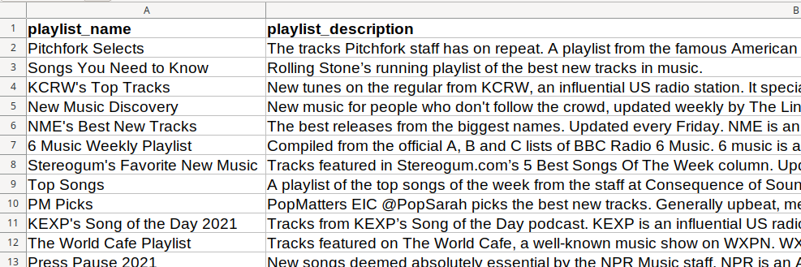

+++
title = "Automating new music discovery in Spotify without using its algorithms"
description = "An amateur python coder's attempt at making it easier to find new music on Spotify using its API, without relying on what the algorithms recommend"
+++

Automating new music discovery in Spotify by mining the choices/taste/ALT of music publications and tastemakers

AGGREGATING CRITICAL, EXPERT, TASTEMAKER WISDOM

-HAVE MORE SUBHEADS, THERE NEEDS TO BE VISUAL RELIEF IN BETWEEN TOO

* TLDR
    -DO THIS LAST AFTER YOU'VE WRITTEN THE FINAL DRAFT
    * SHOULD I HAVE AN OUTLINE OR TABLE OF CONTENT OF WHAT I'M GOING TO DO HERE?
    -Maybe have an outline, without being on the nose about it or making it so obvious that it's an outline

If you don't want to code anything and just want the music, here's a [demo----->PUT_LINK](PUT_LINK) playlist created using the default settings. My own personal playlist mines 33 new music playlists and can be seen [here](https://open.spotify.com/playlist/3XidTKBIpsGymPCjlN7kZH).

SAY THAT YO"RE PROVIDNG LINK TO THE SCRIPT BELOW OR PUT IN TLDR

When it comes to finding new music to listen to, my usual sources are Spotify playlists, online radio streams and YouTube channels. I love music, but my music discovery routine is difficult to go through every week. 

Having to go to each individual website, realizing that "Oh, didnt go to livesessions.npr.org last week, so got to do it this week". The very fact that I call it a 'routine' shows how it's become a chore for me, a sequence of steps to follow every week. 

So I've decided to simplify my music discovery process and make it less of a 'routine' by collecting all the new music I should be listening to in one Spotify playlist. Reduce those multiple steps into a single one, stick to that one playlist and be happy with that.

What I've done is mined various playlists on Spotify that explore the new music that's released every week. These playlists are from radio stations like KCRW in LA and KEXP in Seattle, music websites like Pitchfork and Line of Best Fit (UK), and traditional publications like Rolling Stone.

These are stations, websites and publications that care about music and are considered tastemakers in the US and UK. And by aggregating all their choices in one playlist, I get to benefit from their collective musical wisdom without having to invest hours of my time.

If you're a Spotify obsessive, you could point out that Spotify has its own playlists, human-curated ones like 'New Music Friday' and algorithmic ones like 'Release Radar' that specifically go into the new music released that week. So why reinvent the wheel?

The thing is these publications, websites and radio stations whose playlists I'm aggregating are ones I respect. They were part of my routine, so it's important to me that they're still part of my music discovery process. Their presence in the process is reassuring to me./NEED_THIS_REASSURING BIT?

CAN PUT IMPORTANT FOR ME TO LISTEN AND REJECT POINT HERE
So who's recommending the music also matters in addition to what music is recommended. I amy end up not liking what these tastemakers recommendl, it wasnt recommended with/isnt catering to my musical tastes in mind at all, but i'll still want to listen to it. It's important for me to at least to have listend to these recommendations and then reject them, then to have never listened to them at all.

Am sure the curators behind Spotify's playlists have excellent judgement too, they wouldn't have been hired if they didn't. But the fact that these playlists are from curators I don't know and that they don't have the backing/buttress/ALT of institutions that have authority in musical circles, makes me trust/ALT these Spotify playlists and their judgement a little less. There is no authority beign brought to bear here.

That's pretty much my issue with Spotify's algorithmic playlists as well. I've listened to the weekly algorithmic playlists they put out 'Discover Weekly' and 'Release Radar' once or twice, and the recommendations in them aren't bad. But again,  And that there is no superior authority or musicianship or criticship / RIGHT WORD which is being brought to bear here on these recommendations.

To be clear, I'm not exactly a 'down with algorithms' guy. If your issue with Spotify's algorithmic playlists is that there is a sameness to the music, you're not getting exposed to different artists, and you fear you'll end up in a musical filter [bubble](https://www.reddit.com/r/LetsTalkMusic/comments/g8m4m2/spotify_radio_from_song_or_album_is_it_just_me_or/), my feeling is that these issues are correctable. The algorithms can be tweaked to bring more diversity into Spotify's recommendations. 

If you want to continue using Spotify, but want to reduce your reliance on its algorithms, you can use the script I've put up on [Gitub](https://github.com/shijithpk/music-discovery) to generate very diverse playlists. I'm aggregating playlists from tastemakers, but you can add playlists from any user you find on Spotify. It doesn't have to be just for new music either. For example, you could aggregate lo-fi playlists from various users to get a different lo-fi playlist every week.

IMPLEMENTATION

The internet isn't short of playlist creation tools for Spotify. The thing is most of them are [about](https://dubolt.com/) generating playlists of music based on a song or artist you seed it with. Or generating playlists based on a [keyword](http://playlistminer.playlistmachinery.com/).

This script tries to do something different by generating a playlist based on your choice of tastemaker or musical authority. And also update it every week, once you schedule it that way. For most tools, playlist generation is a one-time exercise with no updates.

There isn't anything sophisticated about the code, it's just a python script.

The implementation will be basic for many developers, but hopefully it'll meet the need of 
* amateur coders who want to spend less time finding new music
* lifehackers who want to automate aspects of their lives and, 
* in general, anyone who wants to simplify their Spotify experience.

There are 75 playlists users can choose to aggregate. They're all new music playlists updated every week or month, from important music publications, websites and radio stations in the US and UK. While most of the playlists explore new music across genres, some are genre-specific, some focus on new music from emerging artists, while others focus on tracks from new albums. 

6 playlists (from Pitchfork, Rolling Stone, KCRW in the US and from Line of Best Fit, NME, BBC Radio 6 in the UK) have been pre-selected to give a user default choices to start with, but they can be un-selected.

If you follow the instructions in the github [repo](https://github.com/shijithpk/music-discovery), you'll end up with a playlist titled 'New Music for \< your Spotify user id \>' in your Spotify libary.

Note that your playlist is wiped clean and new tracks are added every time you run the script. So you'll need to get through the songs on the playlist before you run the script again. 

You don't have to make it a chore though. Or get anxious about finishing the playlist. Just have it running in the background while you're working or browsing, 'like' songs to add them to your liked songs list and skip liberally. There's [no limit](https://www.theverge.com/2020/5/26/21270409/spotify-song-library-limit-removed-music-downloads-playlists-feature) in Spotify to how many songs you can 'like'. You can decide later what you want to do with your liked songs. (Put some on a workout playlist, others on an office playlist etc.)

A demo playlist created using the six default choices is [here----->PUT_LINK](PUT_LINK). 

My code and further details about my implementation are available in the github [repo](https://github.com/shijithpk/music-discovery).

mining critical expert knowledge here

In other words, I'm aggreating the musical prefences of diffiernt websites and publications and distilling/consolidating/ALT it in this one playlist

put link to playlists in spotify copy

For these playlists, there is pre-existing or traditional authority to them that is outside/independent of the spotify eco-system. 

integrate their musical preferences

if this will spur/encourage/ALT people to do something like this for their own music listening, 'incept' this idea in their heads (TOO INFORMAL LANAGUAGE), give them some kind of model to strcuture to follow or even improve on, make them think 'oh this is cool, i should do this too' and even improve on it in their own implmentation, or encourage others to talk about their own more sophisticated music discovery automation setups, this post will have done some good.

using this tool will help you make spotify your sole interface/ALT/device for music discovery, if that's what you want