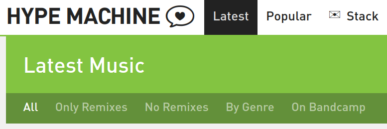
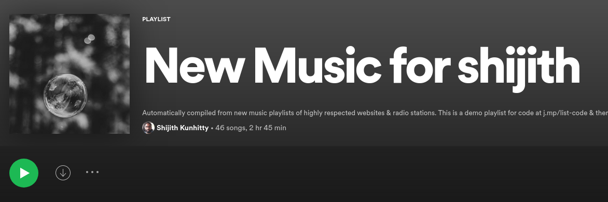

+++
title = "Finding new music on Spotify by aggregating the choices of tastemakers"
description = "An amateur coder's attempt to make discovering new music easier by combining playlists from influential websites."
[extra]
thumbnail = 'logos.jpg'
+++

### TLDR
I'm an amateur python coder and I write here about trying to make it easier to find new music. I do this by essentially combining playlists from influential music websites and radio stations into a single one on Spotify. 

Have decided to do this and not use Spotify's human-curated and algorithmic playlists because they lack authority for me.

The simple python script I've written for aggregating playlists is in this [Github repo](https://github.com/shijithpk/music-discovery).

If you don't want to code anything and just want the music, you have two options:
1. Follow a [demo playlist](https://open.spotify.com/playlist/0kqXhlpDiRbab64ip8g8Ap) created using the default choices.
2. Follow my [personal playlist](https://open.spotify.com/playlist/3XidTKBIpsGymPCjlN7kZH) that mines 33 sources of new music.  

### My earlier routine for finding music
When it comes to finding new music, my usual sources were Spotify playlists, online radio streams and YouTube channels. I love music, but going through each of them is difficult to do every week. 

Having to visit each individual website, realizing that "Oh, I didnt go to [NPR Live Sessions](https://livesessions.npr.org/) last week, so got to do it this week". The very fact that I call it a 'routine' shows how it had become a chore for me, a sequence of steps to follow every week. 

So I've decided to simplify my music discovery process, and make it less of a 'routine' by collecting all the new music I should be listening to in one Spotify playlist. Reduce those multiple steps into a single one, stick to that one playlist and be happy with that.

What I've done is I've mined various playlists on Spotify that look at the new music that's released every week. These playlists are from radio stations like [KCRW](https://www.kcrw.com/) and BBC [Radio 6](bbc.co.uk/6music), music websites like [Pitchfork](https://pitchfork.com/) and [Line of Best Fit](https://www.thelineofbestfit.com/), and traditional publications like [Rolling Stone](https://www.rollingstone.com/).

These are stations, websites and publications that care about music and are considered tastemakers in the US and UK. And by aggregating their choices, I get to benefit from their collective musical wisdom in one playlist without investing hours of my time.

### Why I'm not using Spotify's own playlists
If you're a Spotify obsessive, you could point out that it has its own playlists, human-curated ones like '[New Music Friday](https://open.spotify.com/playlist/37i9dQZF1DX4JAvHpjipBk)' and algorithmic ones like 'Release Radar' that specifically look at the new music released in the week. So why reinvent the wheel?

The thing is the websites and stations whose playlists I'm aggregating are widely respected. I may not like some of the songs these tastemakers recommend, but it's important for me to hear these recommendations and then maybe reject them, than to never hear them at all.

They were also part of my routine earlier, so it's important to me that they remain part of my music discovery process.

No doubt, Spotify's own playlists are very [influential](https://www.theguardian.com/music/2019/apr/28/streaming-music-algorithms-spotify) and the curators behind them have become minor [celebrities](https://edmreviewer.com/2020/04/20/austin-kramer-the-god-of-edm/) in their own right. But since these playlists aren't from established sources of musical authority or from institutions I'm familiar with, I value their judgement a little less.

### If you want to rely less on Spotify's algorithms
To be clear, I'm not exactly a 'down with algorithms' guy.  If your issue with Spotify's algorithmic playlists is that there is a sameness to the music, that you're not getting exposed to different artists, and you fear you'll end up in a musical [filter bubble](https://www.reddit.com/r/LetsTalkMusic/comments/g8m4m2/spotify_radio_from_song_or_album_is_it_just_me_or/), my feeling is these issues are correctable. The algorithms can be tweaked to make Spotify's recommendations more diverse. 

But if you've made up your mind about Spotify and want to rely less on its algorithms, you can use the script I've put up on [Github](https://github.com/shijithpk/music-discovery) to generate musically varied playlists.

I'm aggregating playlists from tastemakers in my script, but you can collect playlists from any user you find on Spotify. It doesn't have to just be for new music either. For example, you could aggregate acoustic music playlists from various users to get a new acoustic playlist every week.

### The gap this tool fills
The internet isn't short of playlist creation tools for Spotify. The thing is most of them are [about](https://dubolt.com/) generating playlists of music based on a song or artist you seed it with. Or generating playlists based on a [keyword](http://playlistminer.playlistmachinery.com/).

This script tries to do something different by generating a playlist based on your choice of musical authority. And also update it every week, once you schedule it that way. For most tools (with one [exception](https://mixtapemanager.ca/)), playlist generation is a one-time exercise with no updates.

One website that tries to aggregate tastemaker preferences like this is [Hype Machine](https://hypem.com). It collects recommendations from hundreds of music websites, blogs etc. and has its own interface for listening to music. The thing is, for many people their musical world is centred around Spotify and Apple Music, but Hype Machine isn't integrated with those apps.

### How it's implemented
There isn't anything sophisticated being done here, it's just a python script. But hopefully this will meet the needs of 
* amateur coders who want to spend less time finding new music
* lifehackers who want to automate aspects of their lives and, 
* in general, anyone who wants to simplify their Spotify experience.

There are 75 playlists users can choose to aggregate. They're all new music playlists, updated every week/month, from important music publications, websites and radio stations in the US and UK. While most of the playlists explore new music across genres, some are genre-specific, some focus on new music from emerging artists, while others focus on tracks from new albums. 

6 playlists (from Pitchfork, Rolling Stone, KCRW in the US and Line of Best Fit, NME, BBC Radio 6 in the UK) have been pre-selected to give a user default choices to start with, but they can be un-selected.

If you follow the instructions in the [Github repo](https://github.com/shijithpk/music-discovery), you'll end up with a playlist titled 'New Music for \< your Spotify user id \>' in your Spotify library.

A demo playlist created using the six default choices is [here](https://open.spotify.com/playlist/0kqXhlpDiRbab64ip8g8Ap).

### Don't turn music into work
Note that your playlist is wiped clean and new tracks are added every time you run the script. So you'll need to get through the songs on the playlist before you run the script again. 

You don't have to make it a chore though, or get anxious about finishing the playlist. Just have it running in the background while you're working or browsing, 'like' songs to add them to your liked songs list, and skip liberally. 

There's [no limit](https://www.theverge.com/2020/5/26/21270409/spotify-song-library-limit-removed-music-downloads-playlists-feature) in Spotify to how many songs you can like. You can then decide later what you want to do with your liked songs. Put some on a workout playlist, others on an office playlist etc.

### For more details
The code, and more details about the implementation are available in the [Github repo](https://github.com/shijithpk/music-discovery).

Hopefully, this tool will give people a model to build on, and create even better setups for finding new music.
