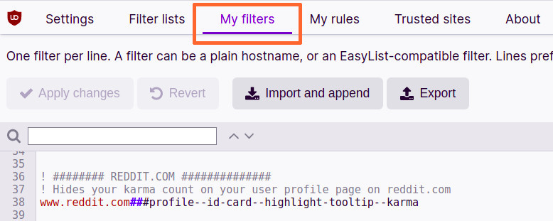
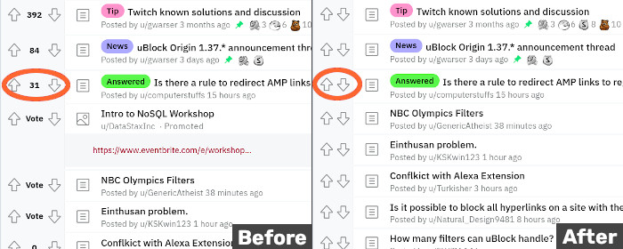
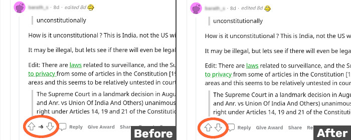
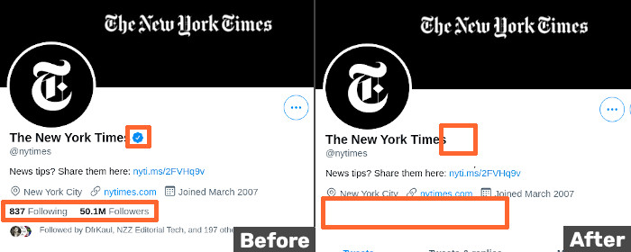
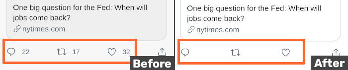
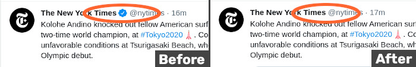
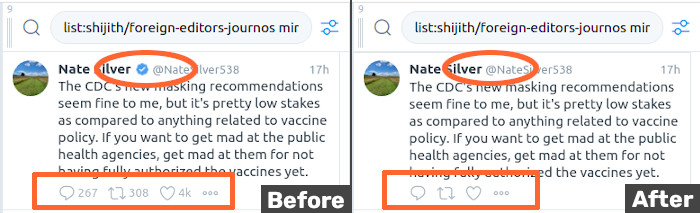
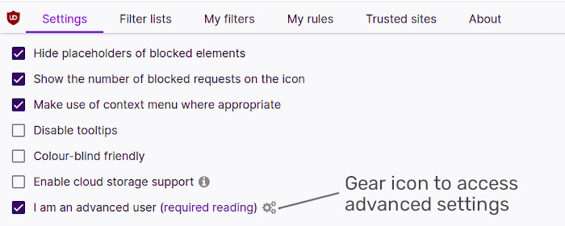

+++
title = "Hide like counts on Twitter and karma points on Reddit with uBlock Origin"
description = "Improve your digital wellbeing by removing all the stats social media websites push on you"
[extra]
thumbnail = 'social_media_image.png'
+++

### Summary
The post is about how I use the adblocker [uBlock Origin](https://github.com/gorhill/uBlock) to hide like/retweet counts on Twitter, and karma points on Reddit.

The motivation being that by removing all these stats social media pushes on you, you can have a better experience on these platforms and improve your digital wellbeing.

To remove all the tweet/post/user stats, install uBlock Origin for your browser, copy the filters from this [Github repo](https://github.com/shijithpk/hide_like_counts_with_ublock) and paste it into the 'My filters' section. 

<!--  -->


These filters are mainly for people who use Reddit and Twitter on their desktops, sorry mobile app users. It could be used on mobile with a Firefox-uBlock combo (Android) or Safari-AdGuard (iOS), but I haven't tested them. The filters could be used in adblockers other than uBlock Origin, but you'll have to check first.

### Why I created these filters
The initial reason was to stop myself from getting upset over downvotes on Reddit. I'm particularly active on the subreddit for my home state, but saying anything unpopular has consequences with trolls downvoting your comment and bringing down your overall user [karma](https://www.reddit.com/r/karma/wiki/index/faq/).

I was angry about this in the beginning, but realised that I could either stop expressing my opinions to keep my karma from going down, or I could continue saying what I have to say. I decided to not censor myself, and do something so that others' downvotes don't affect me.

The solution I came up with was to use my adblocker to hide my user karma from my screen, and also hide how many downvotes my comments are getting. So the points become out of sight, out of mind and I don't stress over them anymore.

This is a screenshot of a subreddit homepage where the vote count gets hidden after applying my filters.


<!--  -->

In this before and after screenshot, the vote count for comments under a post are hidden.


<!--   -->

Note that these filters still allow you to upvote or downvote posts or comments, so you can still engage with Reddit. Everything still works the same, just that the stats get hidden now.

It's not just the vote counts for your own posts/comments that get hidden, but those of everyone else too. And I think this might be a better way of doing things. Your judgement of a post's or comment's worth will now not be dependent on how many votes it's gotten, but only on whether you think it's good or not.

### Creating filters for Twitter

Doing something similar for Twitter was kind of an afterthought. I didn't really feel the need to do something for it like I did for Reddit. 

But I know that Instagram is [introducing](https://about.instagram.com/blog/announcements/giving-people-more-control) the option to hide like counts for their posts. So, as an experiment, I wanted to experience what Twitter would be like without like and retweet counts, follower counts etc.

Below is a before and after screenshot of NYT's Twitter profile where the follower count gets hidden, as well as the blue tick.
<!-- -->


This is a before and after screenshot for a tweet where the reply, retweet and like counts get hidden.
<!--  -->


And in the spirit of evaluating people's tweets based purely on the content, I decided to remove blue ticks from the Twitter interface too, so that I didn't look at tweets coming from verified handles more favourably. 

<!-- -->


I've browsed Twitter this way for a few weeks now, and while I don't really miss the retweet/like counts or the blue ticks, I do miss the reply count.

The quality of replies to tweets can be pretty poor sometimes, but there's always a few people in there with good insights. No reply counts means I don't see which tweets are getting responses, so I don't know which tweets I need to click on to get to those insights. The reply count is important for the way I use Twitter, so that's something I'm considering keeping and not hiding.

### Extending it to Tweetdeck

I also use Tweetdeck heavily, so there are filters in my list for Tweetdeck too. As with the main website Twitter.com, I'm considering unhiding the reply counts.

<!--  -->


For hiding all the blue ticks in Tweetdeck, there's some extra steps you have to take, check the [additional instructions](#additional-instructions).

### Wrapping up

The first time you use these filters, the interfaces of these websites will look dramatically different. If there are any particular changes you want to undo, comment out the individual filter responsible in uBlock Origin. There's a line above each filter explaining what it does.

And if the layout of these websites change in a way that make these filters ineffective, I'll keep the [Github repo](https://github.com/shijithpk/hide_like_counts_with_ublock) updated with working versions of these filters.

You can even set up your own filters to deal with annoyances on other websites. This [YouTube video](https://www.youtube.com/watch?v=2lisQQmWQkY) is a good intro to uBlock Origin and this [wiki](https://github.com/gorhill/uBlock/wiki) goes into all the details.

Twitter and Reddit may eventually introduce settings like Facebook and Instagram have to hide like/vote counts, but till that happens, this [filter list](https://github.com/shijithpk/hide_like_counts_with_ublock) is a handy option.


### Suggestions, feedback
I'm not a professional developer/programmer/coder, so am sure there are things here I should be doing differently. If you have any suggestions, please let me know at mail@shijith.com or at my Twitter handle [@shijith](https://twitter.com/shijith).

For example, I understand a filter will be more efficient, the smaller the initial set of nodes it goes through on a webpage. So if you have advice on optimising these filters even further, do let me know!

### Additional Instructions

You need to follow this only if you're as insistent/anal as I am about removing all blue tick symbols from Tweetdeck. This is for removing the blue tick when you click on a tweet from a verified user and you get an expanded view in the column. Go to the 'Settings' tab of uBlock, tick 'I am an advanced user', click the gears icon next to the setting, after which a text file with all the advanced settings will open up. 

<!--  -->



Go to 'userResourcesLocation' at the bottom of the file, and in the place of 'unset', paste this url
```
https://raw.githubusercontent.com/gorhill/uBlock/master/assets/resources/scriptlets.js
``` 
and you're done. The filter that removes this particular blue tick will now work.

It isn't a perfect solution as the blue tick flashes for a second next to the handle before disappearing. So if you notice it, you still come to know who's verified or not. Will update the [Github repo]((https://github.com/shijithpk/hide_like_counts_with_ublock)) if I come up with a better method.
