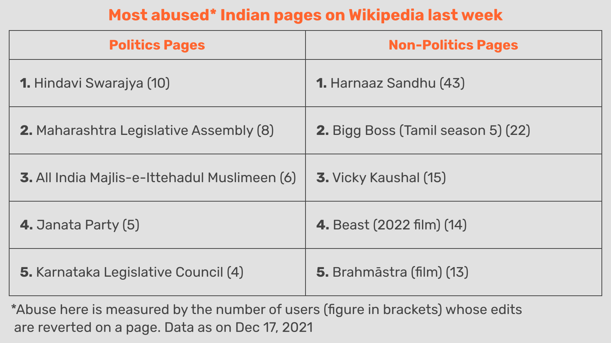
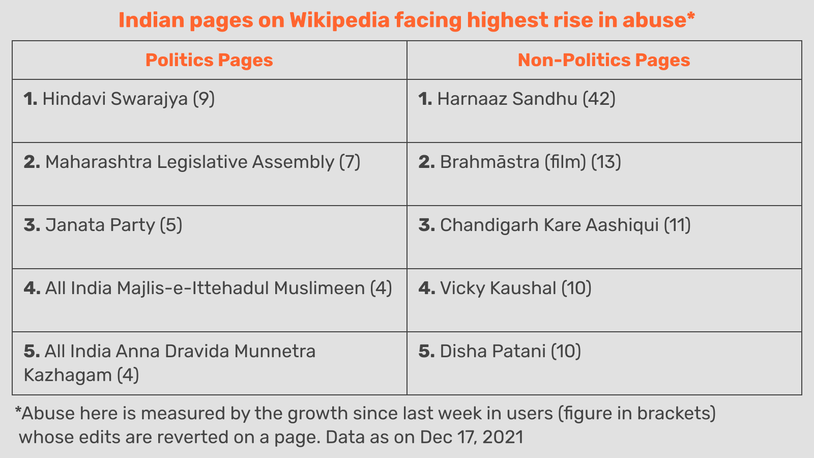
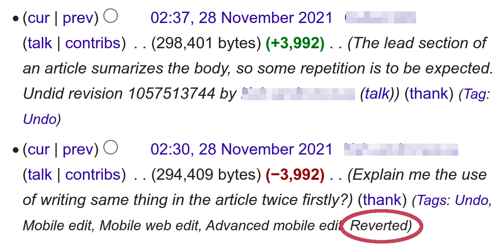
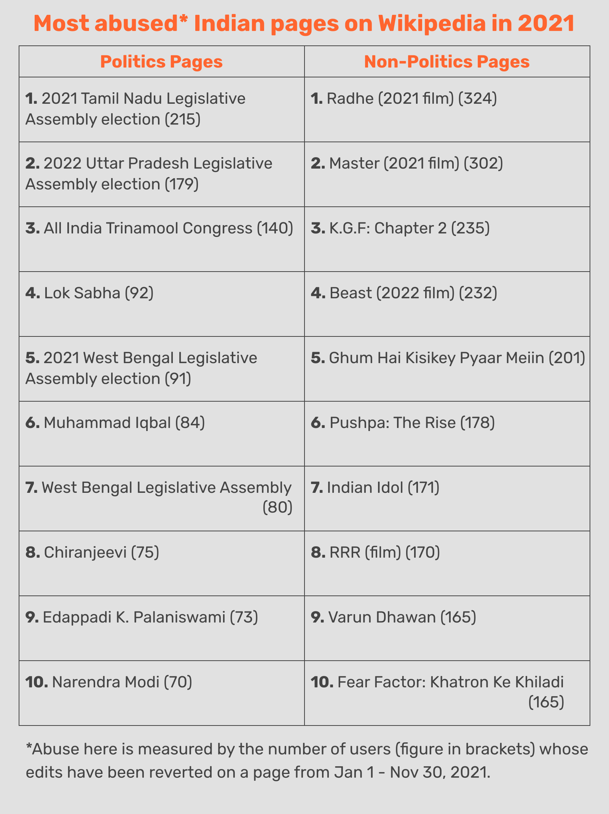
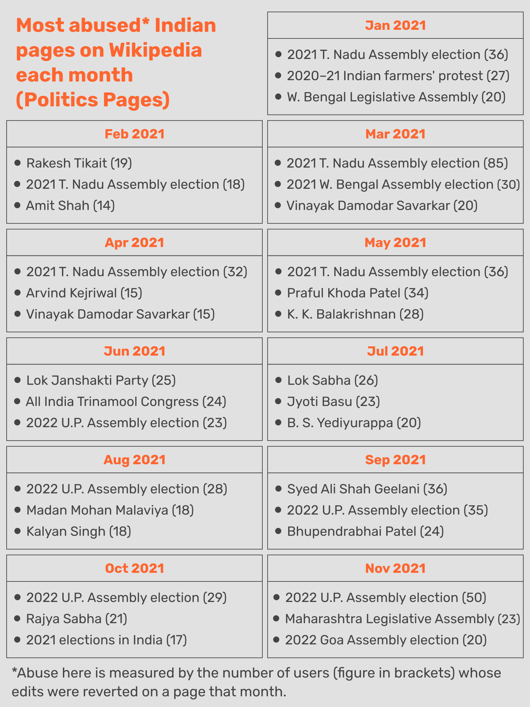
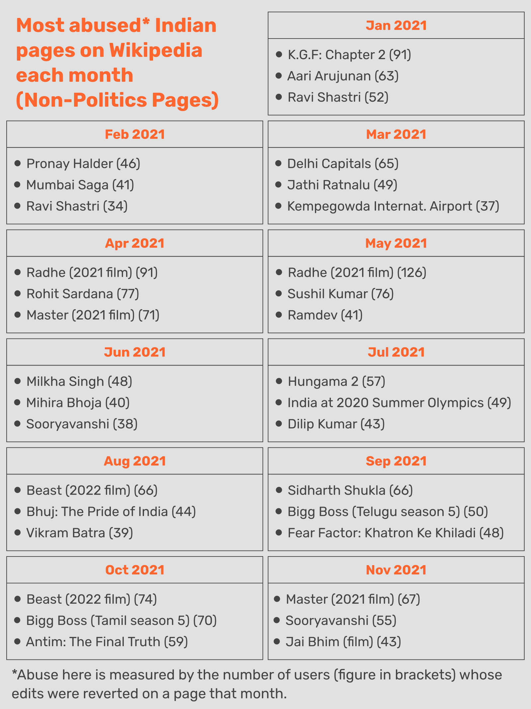
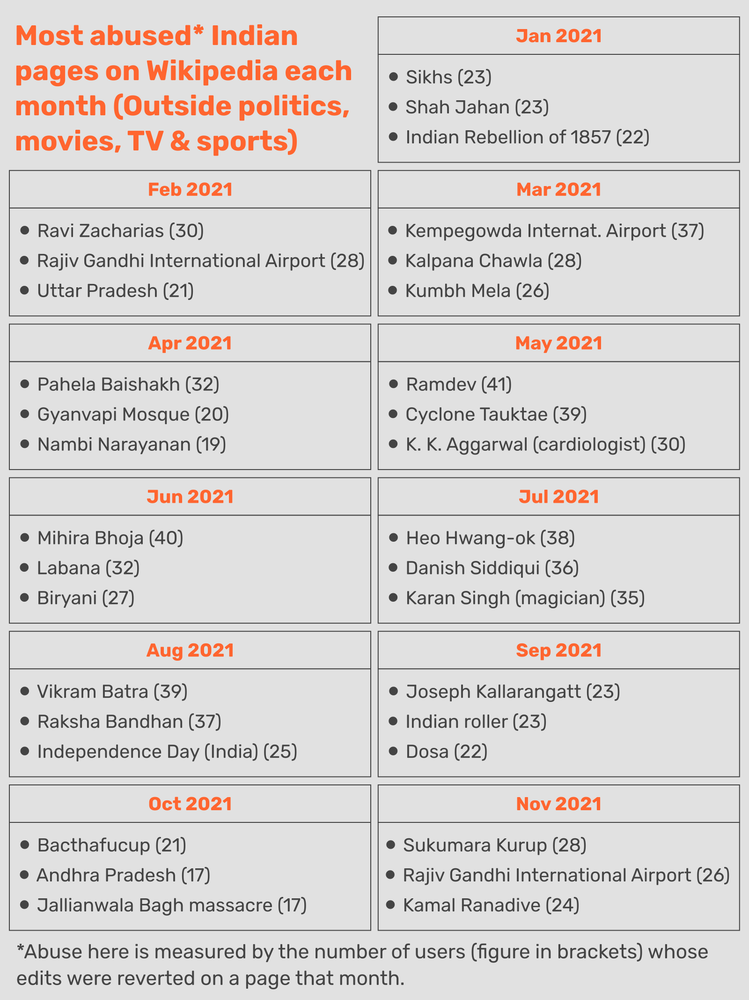

+++
title = "Which wikipedia pages in India are abused the most?"
description = "A look at how Indians tried to distort facts in 2021 and get their own version of the truth onto wikipedia's pages"
[extra]
thumbnail = 'wikipedia_logo.webp'
+++

### TLDR
This post tries to find out which wikipedia pages on India are abused the most. And by abuse, I mean people editing wikipedia pages to twist the truth and present their own version of events. Abuse here also covers blatant vandalism like deleting whole sections from a page. 

The level of abuse was determined by checking over 150,000 pages related to India on Wikipedia, going through their edit histories, and tallying how many users have had edits reverted. An edit being reverted is a sign that the edit was bad, or worse, malicious. So the number of users getting reverted on a page gives an idea of how much abuse a page is facing.

For 2021 (or to be precise, the first 11 months of 2021), the page on the 2021 Tamil Nadu assembly elections was the page most abused with 215 users having their edits reverted this year. And if we look at pages outside politics, the page on the 2021 Bollywood movie 'Radhe' was the most violated, with 324 users having their edits reverted. 

The post goes into how these conclusions were reached, and introduces a [twitter account](https://twitter.com/abuse_checker) that tracks this abuse weekly.

### Motivation for the post
Decided to do this analysis after reading an [article](https://www.onmanorama.com/news/kerala/2021/08/15/onam-wikipedia-page-edit-wars-right-wing-mobs.amp.html) by Ronnie Kuriakose about the wikipedia page on Onam. It was being repeatedly changed to emphasise the festival's Hindu aspects, and play down how Onam is celebrated  across religious communities in the state. Googling a little more about wikipedia abuse in India, I then came across a [story](https://caravanmagazine.in/media/wikipedia-earned-ire-hindu-right) by Nishant Kauntia about how wikipedia pages related to current events were being altered. For example, the page on the Delhi riots of 2020 was being continually edited to misrepresent the role Hindu mobs played in attacking Muslims.

After reading these news stories, I wanted to see if I could keep track of these wikipedia attacks in a systematic way. So not wait for a reporter to get wind of these things happening on Wikipedia, and then tell me about it through an article. But build some tool that flags articles being subject to mass abuse, and does so on a periodic basis.

The tool's results can be seen on twitter at [@abuse_checker](https://twitter.com/abuse_checker), which will tweet out two simple graphics every Monday morning. The first graphic names pages, political and non-political, that were abused the most the previous week. And the second graphic, the pages facing the biggest delta or increase in abuse compared to the week earlier. Here's the graphics for this week:

### Why tracking abuse could be important
The thing is Wikipedia is very important to the online world. It's one of the top results in any google search, and is also the source for infocards that appear next to google searches. It's not an exaggeration to say that wikipedia is a foundational source of knowledge on the internet now. So getting to shape its pages in a certain way theoretically allows you to influence how others think about a topic.

It's a matter for academia whether influence works as uni-directional or one-way as this, or if this is an overstatement of wikipedia's power, but there is no doubt that the people abusing the website believe it to be important in some way or the other, and that belief drives their need to alter its content.

### Measuring abuse
The way I'm measuring abuse is by counting the number of users who've had their edits reverted over a period. So what happens is every time a wikipedia user tries to do something malicious on a page and they're found out, an editor tries to improve the edit first by rephrasing or correcting it. But if there's too much that's wrong about the offending edit, it's then tagged as 'reverted' and the page restored to the version that existed prior to the reverted edit. So if you add up the number of edits tagged 'reverted', you should get an idea of how much abuse a page is being subject to.

Screenshot of a page's edit history where an edit has been tagged reverted (circled in red)

But I try to do one better by not tallying up the number of reverted edits, but tallying up the number of users responsible for those edits. I wanted to avoid situations where a few users may be doing most of the malicious edits on a page. The number of unique users also gives a better idea of how widespread online discontent may be with a particular page.

Now even edits that are done in good faith and without intending to twist the truth can fall short of wikipedia's standards and get reverted. So the final figures will have a margin of error to them, but they should still be good enough to give a sense of which pages are the most abused.

As for which pages were chosen for monitoring, over 150,000 articles assessed by [WikiProject India](https://en.m.wikipedia.org/wiki/Wikipedia:WikiProject_India)—a group of wikipedia editors responsible for maintaining articles about India—were taken. A [python script](https://github.com/shijithpk/wikipedia_abuse_checker) checks changes made to these pages every week and then tweets out graphics every Monday morning.

### Most abused pages of 2021

If we look back at 2021 through the lens of wikipedia abuse, which pages have fallen victim the most?

(I should make it clear these violations may have only been on the page for a few hours or days before someone caught it and reverted it. So this is more a record of failed attempts at abuse, rather than successful ones.)

If we just look at articles related to India politics, the page covering the 2021 Tamil Nadu Assembly elections saw the most abuse with 215 users reverted in 2021. Pages about elections that happened this year or are coming up in 2022 like the UP elections generally saw a lot of abuse.

One entry in the top 10 I didn't know much about was Muhammad Iqbal. The national poet of Pakistan, he wrote the patriotic song 'Saare Jahan Se Acha' that many Indians are familiar with, and he was also the first to present the two-nation theory of Muslims deserving their own separate country. 

From what I can make out, the edits reverted are a mixture of vandalism and good-faith edits from users on both sides of the border, with many taking issue with him being referred to as just 'Muhammad Iqbal' instead of a more respectful '[Allama](https://en.wikipedia.org/wiki/Allamah) Muhammad Iqbal'.

The amount of growing interest in the UP elections can be seen by how from August to November, it was one of the pages most abused each month, impressive for an election whose dates haven't even been announced yet.

It's not only pages related to politics that get abused though. If we look outside politics, we see it's pages about movies such as Bollywood film 'Radhe' and Tamil film 'Master' or shows such as 'Indian Idol' and 'Fear Factor' that experience the most vandalism. These edits may not be politically motivated, but the popularity of these movies and shows comes with a price as online mischief-makers flock to such pages.

And if we look at the pages outside politics that were most abused each month, the entries tend to track the release schedule of major movies in Hindi and the southern languages. 

The fact that wikipedia pages on movies face a lot of abuse isn't terribly interesting though. Thanks to the Indian passion for films and cricket, the abuse these pages face is pretty much a given. 

I was a little curious about how the graphic above would look like if we left out pages on movies as well as TV and sports. Just to see what other pages have been attracting attention from bad actors, and if there are any curious surprises that would spring up.

If we look at this new table, some of the entries are explainable, holidays or religious festivals appearing in the list for particular months such as Pahela Baisakh in April or Independence day in August. Other entries seem to be following the news cycle such as Gyanvapi Mosque in April and Cyclone Tauktae in May. 

I did find it interesting that articles on biryani and dosa were also abused. Looking into the page histories, it seems some disputed the origins of biryani in Muslim culinary traditions, some took issue with the article saying the word 'biryani' is derived from Persian, and there were more petty edits like removing Pakistan from a list of countries where biryani is eaten.

For the article on dosa, some abusive edits tried changing the spelling of 'dosa' to 'dosai' to match how it's pronounced in some south indian states. Some argued over whether the oldest recipe for dosa is found in ancient Tamil or ancient Kannada literature, and others over whether it was Tamil or Udupi restaurants that first popularised the dosa in Mumbai. 

### SIDE NOTES
Just putting some random thoughts here I couldn't fit into the copy:

* Now if we see what different reporters write as a unified body of knowledge, am I contributing to it or advancing it in any way with this post? That wikipedia abuse is happening isn't a news point. It's been happening for a long time, and the recent surge in India has been covered well by [Kuriakose](https://www.onmanorama.com/news/kerala/2021/08/15/onam-wikipedia-page-edit-wars-right-wing-mobs.amp.html) and [Kauntia](https://caravanmagazine.in/media/wikipedia-earned-ire-hindu-right). I guess knowing that such and such page was abused the most in 2021 is kind of news-y. But this post isn't really about advancing that body of knowledge or presenting ready-made insights to readers. It's about informing people there's a twitter account available that lets them keep an eye on wikipedia abuse in India, and which they can use to form insights of their own. So I'm being a little less hand hold-y here compared to a traditional journalist.

* Don't know if there'll be much interest in the topic of wikipedia abuse. Maybe not the general audience, but maybe people with an interest in wikipedia issues? Media researchers, casual contributors and the like? I don't expect serious wikipedia editors to be using this though. First of all there'll be at most a week's lag between a page being abused and it appearing in the twitter graphics being put out. So it can't be used as an early-warning system at all. Besides, serious editors have their own systems in place, and can create watchlists of pages to track within wikipedia itself. So yeah, I expect more of a niche audience for this.
    
* Have decided to keep the indicator of abuse simple—number of users reverted on a page over a week or year. I could've gone through academic papers on wikipedia and borrowed a more sophisticated metric, but I think this is easier for people to grasp. I've done work in [the past](https://shijithpk.github.io/world_cup_tourism/index.html) that tries to be conscientiously rigorous, but I don't think journalism is the place for such work. Academic journals maybe, but not publications meant for the general public. In the pursuit of precision and conclusion validity, a lot of data journalism in India has become completely unreadable. I don't think there's anything wrong in admitting upfront that this post is a best-effort attempt, the conclusions may not be completely valid, but that hopefully this promotes the topic of wikipedia abuse in India as a legitimate avenue of research. And that some academic out there does a better job than I did in their paper. But I don't think a journalist should be <i>the one</i> doing that paper.
    
* This is more of a caveat. Some of these pages will have been placed under protection to stop getting abused. Protection could, for example, mean edits by anonymous users not appearing till they're approved, or if someone has been a registered user for less than 4 days and has done less than 10 edits, they won't be able to edit certain pages. The page on Narendra Modi is under even stricter protection—only someone who's been a user for more than 30 days and has done over 500 edits can edit the page, and this has been the case since April. Such protections brings down the abuse levels for many pages, so that should be kept in mind.
    
* Now given the size of India's internet userbase (over 600 million by one estimate), seeing just 215 users abuse a wikipedia page over a year doesn't seem like much. But this is one of those situations that will get worse over the coming years as wikipedia attracts ever more attention from troll armies that form around various interests. So it may be interesting to keep an eye on it.
    
* I'm just looking at the English-language Wikipedia, but if anyone wants to use wikipedia abuse to gauge online discontent at a regional level, they should also look at Indian-language wikipedias and the abuse they experience.

### Suggestions, feedback
If there are things here I should be doing differently, do let me know! Contact me at abuse_checker@shijith.com or at this Twitter handle [@abuse_checker](https://twitter.com/abuse_checker).