+++
title = "What's the best streaming service in India for western music?"
description = "An analysis of how well apps like Spotify cover critically-acclaimed albums in India"
[extra]
thumbnail = 'overall_ratings_blog.webp'
+++

### TLDR

Most streaming services in India offer western music, and I wanted to see how much access they give to critically-acclaimed albums from the past and present. 

I used features like 'Best Albums Ever', 'Best albums of 2021' and so on from top music publications and websites to come up with a list of albums in each genre (Rock, EDM etc.) these services should have.

Services were rated out of 10 in each genre, with the rating corresponding to what percent of the album list they have in their library. To no surprise, Apple or Spotify came first in most lists.

In the overall rating that looks at performance across all genres, the top four spots were taken by global services — Spotify (9.3/10), Apple Music (9.3), YouTube Music (8.9) and Amazon Music (8.5). Of services based in India, only JioSaavn (8.1) came anywhere close.

Ultimately, how well a service does depends on the deals it has in place with groups like Universal Music that control the landscape. An analysis of the albums available on each service and their copyright info shows that Spotify and Apple Music were able to strike deals with a wide variety of groups, resulting in their superior ratings. Other services, especially Indian ones, will have to put similar deals in place to serve listeners better.

### Motivation

I wanted to figure out how well various music services in India cater to people who listen to western music. For example, if you're a discering fan of metal, how happy should you be with Apple, JioSaavn etc.? Does the service offer the best albums from the past few years? If some music critics got together and compiled the best 100 metal albums of all time, how many of them would a service have?

An Indian bass guitarist at a concert. [Kovid Rathee/Unsplash](https://unsplash.com/photos/PHGKkKf9K3I)

So here I'm not really looking at the size of a service's library, but how well they cover music at the 'top end'. So not which service best covers each genre, but which service covers the best of each genre. In the marketing and promotional language for many of these services, they talk about how many millions of songs are there in their library, I won't be using that metric. 

It also won't be a holistic comparison of these services where we get into factors like streaming quality, mobile app features or subscription costs. 

This analysis allows us to see what holes there are in the libraries of these music services, and also helps quantify in concrete terms the difference in coverage between them. Listeners can hopefully use this post to make more informed decisions about which subscription to go for.

### How I went about it

First off, I chose 10 genres (Pop, Rock, Jazz etc.) to represent the diversity of western music. Could've gone for more, I've excluded country and folk music for example, but I think the 10 genres selected cover most of what the West has to offer. 

Then I researched which books, magazines or websites are respected in each genre, and what albums they've deemed as the best of all time (the 'canon') or the best of recent times. For example, for EDM (electronic dance music), the canon was taken from a list of the [most influential albums](https://mixmag.net/feature/the-50-most-influential-dance-music-albums-of-all-time) by dance music publication Mixmag. 

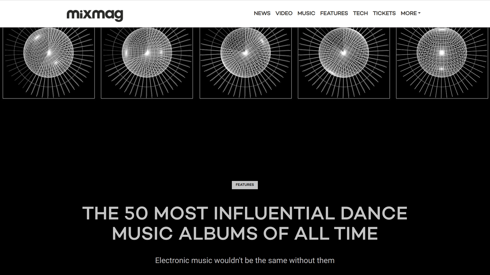

The best contemporary albums were taken from annual 'Best Albums of 20XX' lists from dance publication Resident Advisor for the last 10 years. This gave me a list of 50 albums for the canon and 267 albums for the contemporary category.

These albums were searched for programatically, and sometimes manually, on each of these services. I tallied how many each service had, and after weighting the canon and contemporary equally, a rating for each service was given out of 10. 

Spotify, for example, had 46/50 albums in the canon list, and 236/267 in contemporary. That translates to 4.6/5 points for canon and 4.4/5 for contemporary, for a total rating of 9/10 for EDM.

(A more technical write-up on how I implemented everything, and all the code is available at the [Github repo](https://github.com/shijithpk/music-streaming-india).)

Some genre afficionados could question why one list was chosen and not another. Going for a specific list is actually down to more mundane factors like availability online or how it's been compiled. 

For example, I've used the magazine [Downbeat](https://www.downbeat.com/) to get lists of the best contemporary blues albums for each year. By some accounts, [Living Blues](https://livingblues.com/) magazine is the more respected blues publication, but their annual list isn't compiled by critics but is based on radio airplay, so I decided not to use it.

Also, I accept that these lists are subjective. Ideally, a streaming service should be able to accommodate any best albums list that critics come up with. But taking any one list should good enough as a starting point.

Some might also question the use of albums, instead of individual songs, to compare streaming services. That people [don't really listen to whole albums](https://www.digitalmusicnews.com/2019/10/04/are-albums-dying/) anymore, that they don't consume their music that way. But I felt that checking for, say, 100 whole albums would be a sterner test for these services than checking for 100 individual songs, so I went with albums.

### Overall ratings

If we combine the ratings for different genres, Spotify and Apple Music are tied for top spot with a rating of 9.3/10. YouTube Music comes in 3rd with an overall rating of 8.9 and Amazon Music 4th with 8.5. These four global services taking the top spots isn't that suprising considering the resources they have available to make deals with music groups of all sizes.

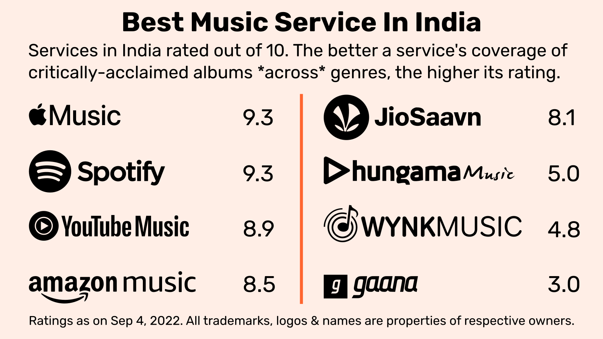

Before I started the research, my gut feeling was that music coverage is pretty much a 'solved' problem in India. That if you're into western music, you can pretty much choose any service and all your musical needs would be met. That services now differentiate themselves on other factors like stream bitrates or plan pricing, and that you choose between services based on those criteria.

I guessed wrong, because outside of Spotify and Apple, there are still significant gaps when it comes to music coverage. If you listen primarily to western music and want to subscribe to a streaming service, it's hard to recommend anything other than Spotify or Apple.

### Pop  

Lists used  
— Canon: Slant ['50 Essential Pop Albums'](https://www.slantmagazine.com/music/vital-pop-50-essential-pop-albums/
)  
— Contemporary: AllMusic ['Favorite Pop Albums'](https://www.allmusic.com/year-in-review/2021/favorite-pop
) annual list 2012-2021

Starting off with Pop—where your Madonnas, Lady Gagas and Taylor Swifts of the world reside—5 of the 8 services do well here with ratings over 9.0, with Apple Music topping at 9.8.

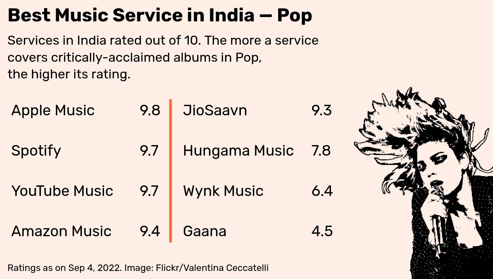

Spotify lost 0.1 points from its pop rating as it didn't have Joni Mitchell's 1974 album 'Court and Spark', seen as part of the canon by Slant's list. This is a result of the '70s icon [pulling her music](https://www.rollingstone.com/music/music-news/joni-mitchell-spotify-catalog-1292397/) from the service to protest against the spread of covid misinformation by Joe Rogan's podcast on Spotify.

### EDM  

Lists used  
— Canon: Mixmag ['50 Most Influential Dance Music Albums Of All Time'](https://mixmag.net/feature/the-50-most-influential-dance-music-albums-of-all-time
)  
— Contemporary: Resident Advisor ['Best Albums'](https://ra.co/features/3950
) annual lists 2012-2021

After hip-hop, EDM I guess has had the most influence on the sound of today's pop music. But for such an influential genre, it doesn't really get much coverage, with only two services Spotify and Apple getting 9 or more.

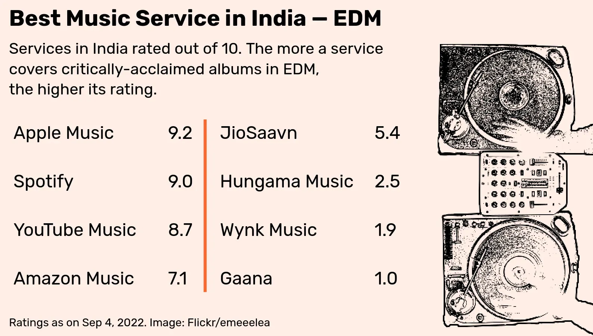

Two albums from the EDM canon — 'Alcachofa' by Ricardo Villalobos and 'Just an Example' by	Shy FX — aren't there on any service in India.

### Rock 

Lists used  
— Canon: Classic Rock ['100 Greatest Rock Albums Ever'](http://pub37.bravenet.com/forum/static/show.php?usernum=3172289350&frmid=10&msgid=603995
)  
— Contemporary: AllMusic ['Favorite Rock Albums'](https://www.allmusic.com/year-in-review/2021/favorite-rock
) annual lists 2012-2021

Rock may not matter as much as it used to, but it's well served as a genre with four services getting ratings over 9 for the genre. There are some holes though in YouTube Music's coverage with no 'Hotel California' album by the Eagles or no 'Electric Ladyland' by Jimi Hendrix.

Neil Young's 2012 album 'Psychedelic Pill' isn't on Spotify, along with several of his older albums. Like Joni Mitchell, he too had his albums [removed from Spotify](https://www.billboard.com/business/streaming/spotify-removes-neil-young-music-joe-rogan-vaccines-1235023517/) to protest against covid misinformation on the platform.

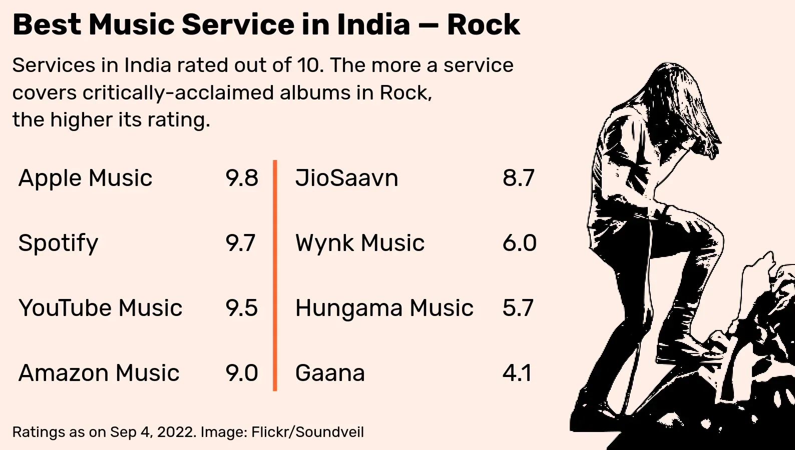

### Metal 

Lists used  
— Canon: Rolling Stone ['100 Greatest Metal Albums Of All Time'](https://www.rollingstone.com/music/music-lists/the-100-greatest-metal-albums-of-all-time-113614/
)  
— Contemporary: Metal Hammer ['Top Metal Albums'](https://www.facebook.com/groups/195830297121202/posts/4779431462094373/
) annual lists 2012-2021  

I'll be honest, I had no idea people were into metal in India. It's only when I started hanging out in [reddit](https://www.reddit.com/r/india/comments/uwkmf1/metalheads_of_rindia_could_you_suggest_your/) did I realise how much of a following it's got here. If we take the genre as a whole, the services cover it well with 5 of them getting ratings over 9. 

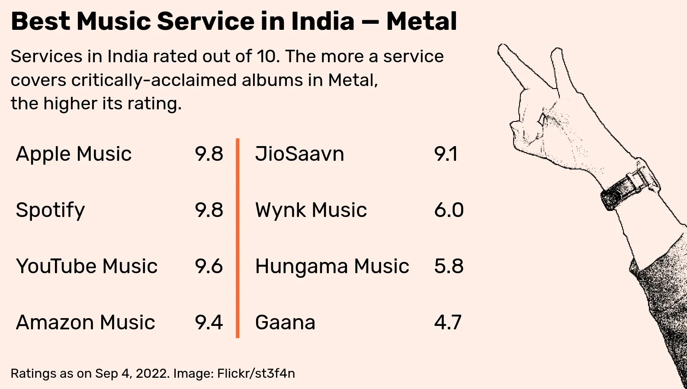

In terms of availability, there's an album 'Jerusalem' by the band Sleep and an album 'Torture Garden' by Naked City that aren't there on any of the services in India. I'm not into metal myself, so don't know how big of a deal that is. But everything else seen as canon by the Rolling Stone list is available either on Apple or Spotify.

### Hip-Hop 

Lists used  
— Canon: HipHopGoldenAge.com ['Best 250 Hip-Hop Albums of All Time'](https://hiphopgoldenage.com/list/the-best-250-hip-hop-albums-of-all-time/
)  
— Contemporary: HotNewHipHop.com ['Hottest Hip-Hop Albums'](https://www.hotnewhiphop.com/top-30-hottest-hip-hop-albums-of-2021-news.143625.html
) annual lists 2012-2021

Very influential, and well served by most of the music services in India, with 5 services scoring over 9. 

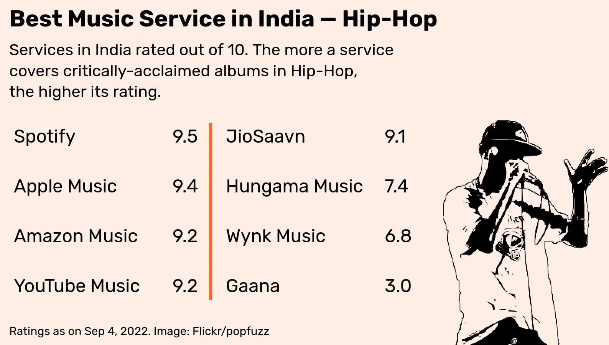

Missing from all services (except curiously JioSaavn) is Snoop Dogg's breakthrough album 'Doggystyle' and another '90s album 'Chronic' by Dr Dre. Seems the albums were pulled because the artists [were unhappy](https://hypebeast.com/2022/4/snoop-dogg-plans-to-start-own-death-row-streaming-platform-app) with how much they were being paid from streaming. 

One of Jay-Z's biggest albums 'The Blueprint' isn't on YouTube Music, not sure why. Seems it was pulled from all services a few years ago to become exclusive to Jay Z's own music service Tidal. It [came back later](https://www.complex.com/music/2019/05/jay-z-blueprint-albums-are-back-on-apple-music) to all services, don't see it on YouTube Music though.

### R&B 

Lists used  
— Canon: BlackExcellence.com ['40 Best R&B Albums Of All Time'](https://www.blackexcellence.com/best-rb-albums-of-all-time-2/
)  
— Contemporary: ThisisRnB.com ['Best R&B Albums'](https://thisisrnb.com/2016/12/thisisrnb-presents-the-20-best-rb-albums-of-2016/
) annual lists 2012-2016, RatedRnB.com ['Best R&B Albums'](https://ratedrnb.com/2021/12/the-30-best-rnb-albums-of-2021-staff-picks/
) annual lists 2017-2021

Artists representing this genre are Beyonce, Mariah Carey and John Legend. Most services do well in the R&B genre, with 5 of them scoring over 9. 

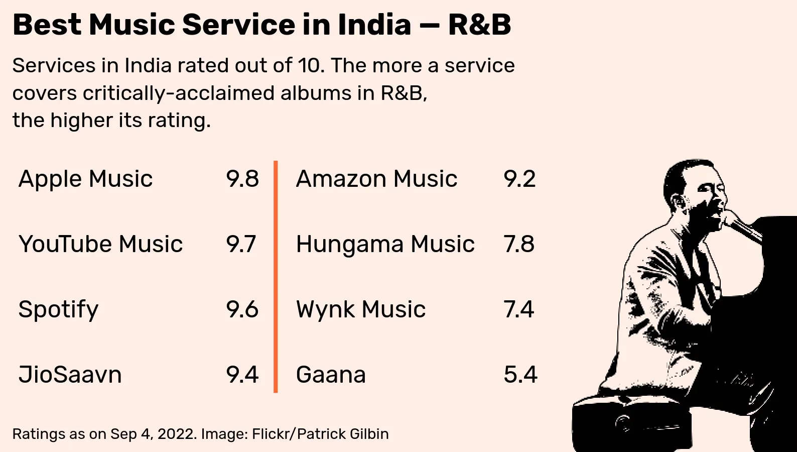

Some past acts whose albums are missing are Boyz II Men ('90s album II missing from YouTube Music) and Alicia Keys (2016 album 'Here' isn't on Amazon Music).

### Jazz 

Lists used  
— Canon: [Albums awarded 'crowns'](https://people.ucalgary.ca/~ghfick/jazz.html
) by Penguin Guide to Jazz recordings  
— Contemporary: Downbeat magazine Critics Poll ['Best Jazz Albums'](https://www.downbeat.com/digitaledition/2021/DB21_08/DB21_08.pdf
) 2012-2021

Jazz is one of only two genres in which no service has a rating over 9 (the other being World Music). It's also the genre that Apple and Spotify do most poorly in. 

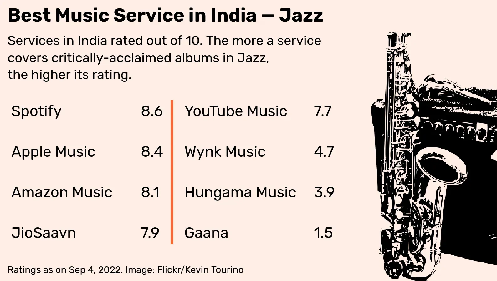

The low ratings are also a result of how strict I've needed to be. Take for example, the compilation album 'Major Works of John Coltrane' which isn't available on any service in India. 

Some of the tracks from that album will be there in other compilations available on each service. So you could technically recreate the experience of listening to the album by making a playlist that cuts and pastes those tracks together. That will feel like you're listening to the album, but it'll still have to be marked as unavailable.

I have made exceptions though. If there's a compilation by another name that has all the tracks of the album and there's not too many extra pieces to sit through, I've accepted that as a substitute.

Another artist whose collected works isn't available on Spotify or Apple is Charlie Parker and his 'Complete Savoy & Dial Studio Recordings'. It is available on Amazon and Youtube Music though. 

### Blues 

Lists used  
— Canon: [Albums awarded 'crowns'](https://people.ucalgary.ca/~ghfick/blues.html
) by Penguin Guide to Blues Recordings  
— Contemporary: Downbeat magazine Critics Poll ['Best Blues Albums'](https://www.downbeat.com/digitaledition/2021/DB21_08/DB21_08.pdf
) 2012-2021

Surprisingly, the major services — Spotify, Apple, YouTube, Amazon — all do better in covering Blues than Jazz. You think it would be the opposite given how Blues and Blues artists aren't as well-known. Spotify even manages to score a 9 here.

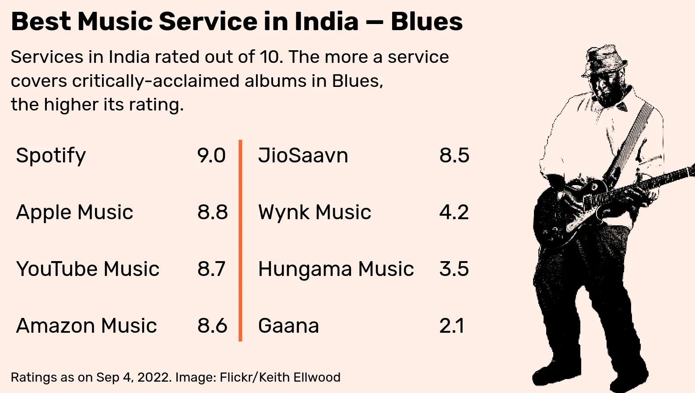

There's one collected work SRV by Stevie Ray Vaughan that's not available on any service. But I don't really listen to the Blues, so I'm not sure how big an omission that is.

### Western Classical  

Lists used  
— Canon: Gramophone Classical Music Guide ['100 Great Recordings'](https://archive.org/details/gramophoneclassi0000unse_x9k8/page/n17/mode/2up
)  
— Contemporary: Gramophone Awards ['Contemporary' category nominees](https://reader.exacteditions.com/issues/96463/spread/19
) 2012-2021

Only Apple and Spotify do well here with ratings over 9. Was surprised to see other global services like YouTube Music and Amazon doing poorly in this, both had ratings around 7.

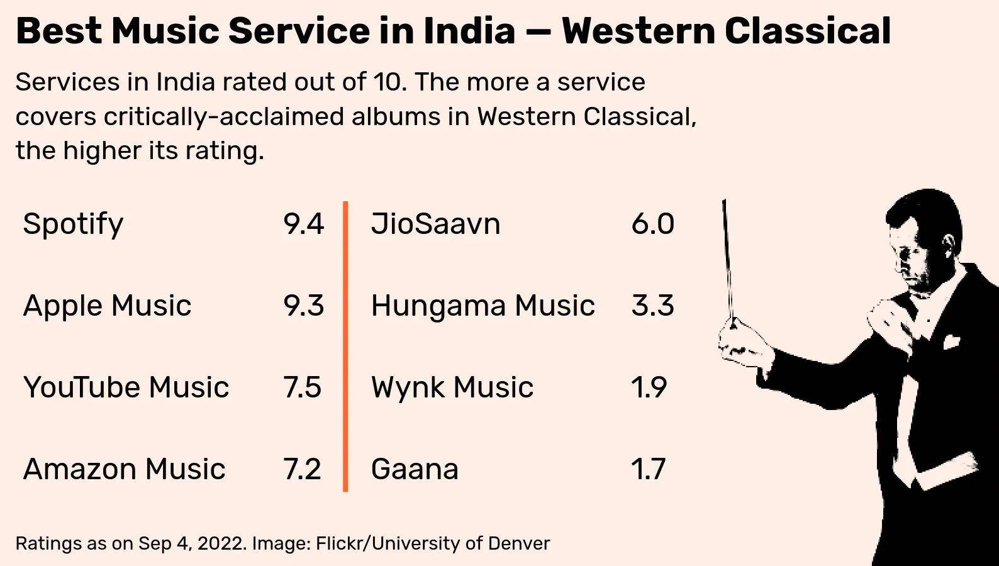

This is a result of how strict I've had to be when it comes to accepting albums as substitutes. The thing with western classical is that there can be a 100 different performances or interpretations of the same work.

For example, if we take the opera 'Fidelio' composed by Beethoven, there's one recording of a performance in 1961 at the Royal Opera House in London conducted by Otto Klemperer. Another recording is of the performance in 1962 at Kingsway Hall in London, also conducted by Klemperer. 

The Gramophone guide recommends the 1961 version, so even if the 1962 version is available on a service, it doesn't count. We may not be privy to the logic why the guide went for one over the other, but we assume that there are good reasons, and so we stick to its choices and try not to deviate from them.

### World Music 

Lists used  
— Canon: [Rough Guide to World Music: 100 Essential CDs](https://osmelhoresdiscos.blogspot.com/2010/08/rough-guide-to-world-100-essential-cds.html
)  
— Contemporary: Songlines ['Best Albums'](https://www.songlines.co.uk/news/the-10-best-albums-of-2021
) annual lists 2012-2021

I guess one could question if a category called 'World Music' should be here. A diverse collection of genres from around the globe, this isn't actually music from the West. 

But given how 'World Music' is a beneficiary of western musical tastes, how it's an important tool used by westerners to organise the musical diversity around them, it felt important to include. (In fact, a more honest title for this blog post is not "What's the best streaming service in India for western music?", but "Which streaming service in India best caters to western musical taste?")

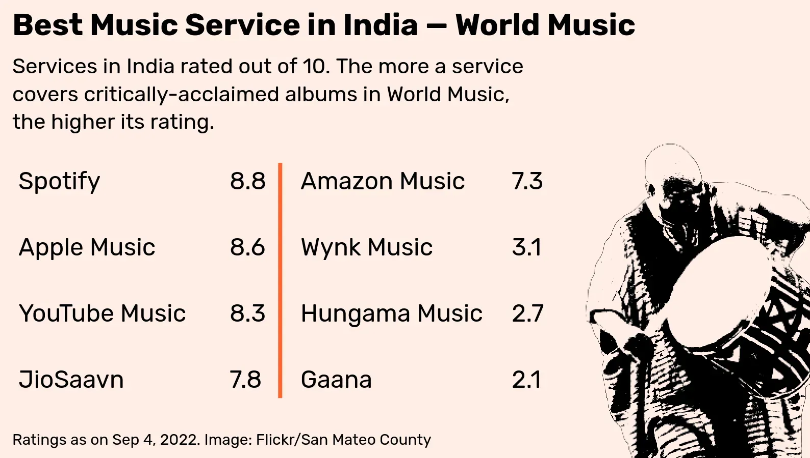

After Jazz, world music is the only other genre where no service has a rating over 9. The closest that comes to it is Spotify with 8.8. 

### Rolling Stone 500 & NME 500

This isn't part of the overall rating, but is just something I was curious about. The [Rolling Stone 500](https://www.rollingstone.com/music/music-lists/best-albums-of-all-time-1062063/
) is the premier list of 'best albums' and it's been around since 2003. The latest version was done in 2020, and [hundreds](https://www.rollingstone.com/music/music-news/voters-500-greatest-albums-list-1062225/) of critics were involved in compiling it. I wanted to see how the various services did when it came to covering the latest RS 500. 5 of the services did well with over 400 of the 500 albums on the list.

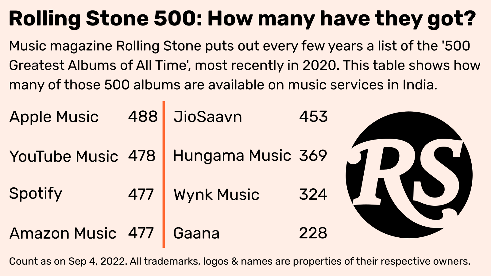

The highest-ranking album on the RS 500 that's not on any service in India is 37th-ranked 'The Chronic' by Dr. Dre. 

I'm a bit of an anglophile, so I also wanted to see how the services would do with a version of the RS 500 that's more UK-oriented. I found ['The 500 Greatest Albums of All Time'](https://www.rocklistmusic.co.uk/nme_500_greatest_albums_2013.htm
) list put out by the British publication NME in 2013, and checked how the services did against that list. All the major services had over 400 of the 500 albums available.

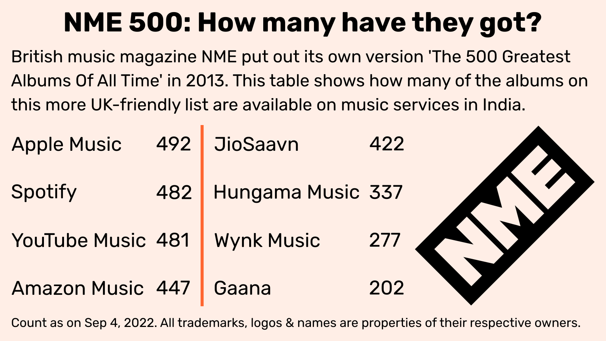

### It all comes down to label agreements

Albums missing from a streaming service, or the service doing poorly in a genre is a result of the deals streaming services have done—or not done—with major labels and other music groups. 

The 'Big Three' majors are Universal Music Group, Sony Music Group and Warner Music Group, and signing deals with these three gives a service access to most music under the sun. Another group that services need to deal with to round out their offerings is [Merlin](https://merlinnetwork.org/), a body that acts on behalf of many independent labels  operating outside the majors.

In a way, what we're actually looking at in this post is the extent of these legal relationships with global music groups, and the 'mapping' from that to different genres and how they're covered. 

The more music groups a streaming service has deals with, and the more extensive the nature of those deals, the better a service's coverage is across genres.

Services don't acquire rights or licenses for single albums, but whole libraries. If an album is part of the catalogue offered under the agreement, the service gets access to it, otherwise they don't.

The webpage for every album on the service website mentions who holds the copyrights. By collecting that info for the over 3,000 albums in our dataset, and by seeing which label is [under which group](https://github.com/shijithpk/music-streaming-india/blob/main/data/label_groups.py), we are able to figure out which albums come under what deals for over 90% of the dataset. 

For example, if you look at the Apple Music page for Aretha Franklin's album ['Amazing Grace'](https://music.apple.com/in/album/amazing-grace-live-at-new-temple-missionary-baptist/1628093959), the copyright info given is '℗ 2022 Atlantic Recording Corporation'. Atlantic record label comes under Warner Music, so this album should come as part of any deal done with Warner.

(There's an additional level of complexity in that there are [different copyrights](https://completemusicupdate.com/article/trends-music-licensing-explained-at-last/) for a song and for the *recording* of a song. And a service has to have deals in place with the different copyright holders if it wants to offer a song. Most services only display the info for the latter correctly, the 'phonographic' copyright ℗, so we'll focus on that. One problem is 'composition' copyrights © to a song could sometimes be with a publishing company under a different music group. But when a streaming service makes a deal with a music major, the deal [usually involves](https://www.musicbusinessworldwide.com/warner-sues-spotify-in-india-as-licensing-negotiations-hit-major-speed-bump/) the publishing company under it, so making deals with all majors should cover all eventualities.)

The table below is an attempt to see how much each music group contributes to the albums in my dataset. Not in absolute numbers, but in terms of the overall rating. Our rating is out of 10, and albums from the Univeral Music Group (including labels like Capitol, Geffen and Decca) are responsible for 2.34 points in our 10 point rating, so its contribution is 23.4%. 

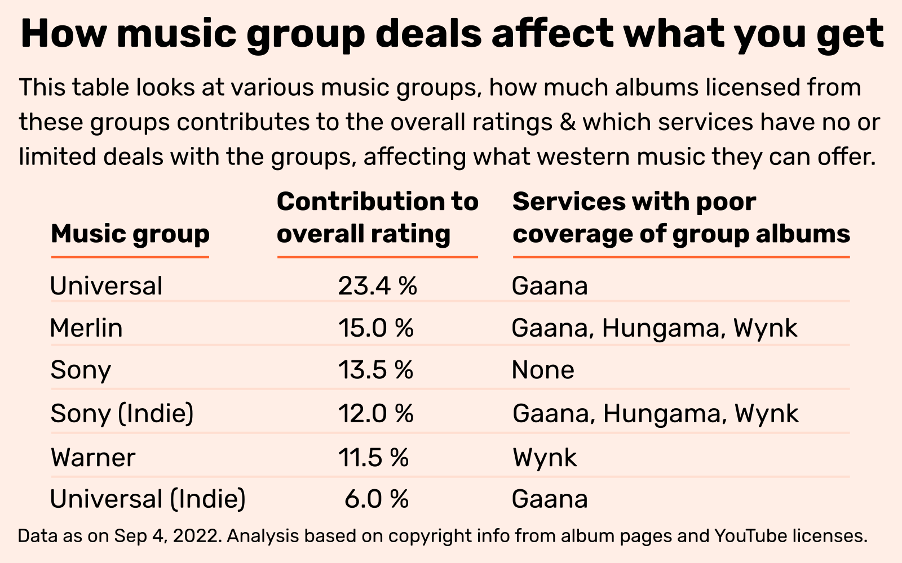

There's a separate entry 'Universal (Indie)' which covers independent labels like Concord whose work is distributed by Universal or its distribution arms like Ingrooves. Don't know if I need this separate category, I'm assuming that music services would need to make separate deals with Universal to cover its own labels, and to cover independent labels distributed by it, and so the latter should be treated differently. Don't know if that's the case in reality, but it felt important to maintain this logical distinction, so I've kept things as is.

Based on the albums that aren't available on a service and their copyright info, we can reasonably speculate about the music groups streaming services don't have deals with.  Gaana has poor coverage of albums from Universal, meaning the Indian service may not have an agreement with them, and so it loses upto 2.3 of 10 points in the overall rating.

Below are my guesses about deals that aren't in place for each service:

**Spotify** — As far as I can make out, they seem to have deals with most of the groups. A record label Ilian Tape [removed its catalogue](https://crackmagazine.net/2022/01/ilian-tape-removes-entire-back-catalogue-from-spotify-says-its-time-for-a-change/) from Spotify to protest against what they see as poor payments for streaming. As a result, 4 EDM albums in the dataset (3 of them from the act Skee Mask) are missing, affecting Spotify's EDM rating.

**Apple Music** — Seems to have deals with most groups

**Amazon Music** — The service in India doesn't have albums from Chrysalis Records, Domino Recording, Merge Records, Sub Pop and Warp Records. This includes albums from acts like Aphex Twin, My Bloody Valentine and Arctic Monkeys. Amazon's Rock and EDM coverage are especially affected by this. These record labels are members of Merlin, but the work of other Merlin members are available on Amazon, so not sure what's going on here.

**YouTube Music** — Albums copyrighted to ECM records are missing from the service in India, affecting its jazz and western classical coverage. A total of 13 jazz and 5 western classical albums from ECM are unavailable. It isn't clear, but ECM is either [a part](https://www.universalmusic.com/label/verve-label-group/#ecm) of the Universal Music Group or an independent label whose work is distributed by Universal. So if YouTube Music has a deal with Universal, not sure why ECM Records albums aren't part of that deal. Many classical music albums copyrighted to Decca Records of Universal are also missing.

**JioSaavn** — There's one prominent music company Beggars Group whose albums are missing from JioSaavn. They aren't associated with any of the majors and are part of Merlin, who actually [have a deal](https://merlinnetwork.org/merlin-and-jiosaavn-sign-enhanced-global-music-licensing-partnership/) with JioSaavn, but I guess Beggars isn't part of it. 

Beggars Group record labels include Matador, Rough Trade and XL Recordings, and artists whose work is missing because of this include Radiohead, EDM act XX and singer Adele. So JioSaavn has Adele's album '30' but not her older album '21'. In total, 14 EDM and 15 Rock albums are missing because of this. From news reports, it seems Beggars prefers to have [their own deals](https://musically.com/2018/04/05/beggars-group-china-real-issue-exclusivity/) with music services in China. So maybe when it comes to larger economies like China and India, Beggars prefers to do deals outside of Merlin to get a bigger cut, and for some reason there isn't a deal with JioSaavn.

**Gaana** — Pretty much all albums associated with Universal Music are missing from the service, which probably means Gaana doesn't have a deal with them. Albums from The Beatles, Nirvana and Kanye West are missing as a result. 

Now when I started my research a few months back, I think these albums were there then, and them not being there now means the deal has lapsed and not been renewed. [A report came out](https://www.reuters.com/technology/exclusive-fighting-survive-tencent-backed-indian-music-app-gaana-turns-2022-09-09/) a few days ago about money being tight at Gaana. Even if I'm mistaken about all this, the fact remains these albums aren't there now, and this absence affects Gaana in all genres. Its overall rating would jump from a lowly 3.0 to 5.3 if it had a deal with Universal.

**Hungama & Wynk** — From what I can tell, neither of them have a deal with Merlin. If they did, their coverage would improve across genres, and the overall rating would go up atleast 1.5 points for both services.

### Caveats, doubts

What more I could've done, and things to keep in mind when going through the findings.

**No Resso** — One service that should've been part of the comparison is Chinese music app Resso. Had no idea this [was around](https://entrackr.com/2020/03/bytedance-resso-launches-in-india/), till I was too far along into my research. But even if I had known about it, I may not have included it because it doesn't have a website interface, and is available only as a desktop or mobile app. Being able to query various services through their websites made my job a lot easier, and, unfortunately, extracting information from mobile apps isn't in my toolbox yet :( 

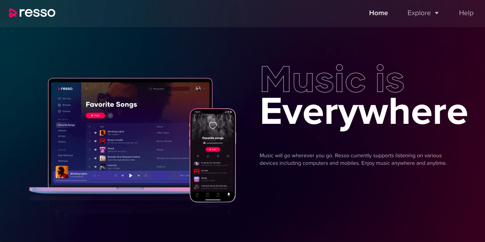

**YouTube excluded** — One service that I've intentionally left out is YouTube itself. The main YouTube isn't a music streaming service, but I'm pretty sure most people in India listen to or 'watch' their music this way. From official videos to pirated ones to bootleg versions, everything's on here. If this was part of the ratings — and putting questions of legality aside — I'm pretty sure YouTube would be on top with a 10/10 score. 

Just felt I should acknowledge how streaming services aren't the only options available to users when it comes to getting music. And that the most popular option isn't here because it's technically a video-sharing platform.

**False positives and negatives** — False positives here are albums the code is telling me are there, but aren't really because they're ['ghost'](./#ghost) albums or albums by a tribute band that's mistaken for the real thing and so on. I've checked most of the results manually, maybe a few might slip through, but on the whole false positives shouldn't be a problem. 

False negatives are albums that are there in a streaming service's library, but my code couldn't find them. I'm trusting my code to be good enough that it gets most of the albums that are available, so even if I do miss a few of them, the service's rating won't be affected by much in most cases. One way to avoid false negatives is to search for albums manually, but I felt that would defeat one of the goals here which is to do everything programatically as much as possible.

**The focus on expert instead of popular tastes** — Another way these ratings could've been constructed is by paying attention to the taste of the masses, as opposed to critics. For determining the canon, I could've looked at what the top 100 best-selling albums of all time are in each genre and checked how many of those 100 each service has. It's just that I felt it important to apply some level of expert judgement since we are talking about the 'best' albums, not 'best-selling' albums. 

Of course, there is the danger that a critic could choose an album that fans don't listen to much. So if it's in the long tail in terms of popularity, should a service be penalised for not having it? Those albums being unavailable might not affect how a listener enjoys a service as long as they provide everything on the popular end of the spectrum.

**Rethink 50% weightage for canon** — The way I've constructed the ratings, 50% weight is given to albums that critics consider the 'canon', the best albums of all time in a genre. But I have the feeling for listeners of particular genres, the canon might not matter as much. Take pop music, where more attention is given by listeners to more recent albums. Here I think it's unlikely that someone who listens to 20-year-old pop singer Billie Eilish would consider it equally important to listen to the Beatles, an act whose main albums came out 5 decades ago. 

While for some other genres like western classical or jazz, I think listeners give more attention to the canon than recent works. Without more of an idea of how people listen, I think the 50-50 split between the canon and more recent work is a neutral and acceptable split. But yes, a case could be made for the split to vary according to the genre to reflect the importance listeners give different time periods, and so make these ratings more useful for them.

**Categories too broad?** — Another issue that could affect the utility of this analysis to listeners is that the categorisation might be too broad for some. For example, I've used metal as a genre, but listener tastes might be more sophisticated in that they listen to sub-genres like death metal or black metal or shoegaze metal, and may not necessarily identify with the larger metal genre. In fact, it might even be important for them to identify *against* such broad tastes. 

So telling someone that some service has this rating for metal wouldn't really matter to them, because what really matters to them is how services do in the particular niche of metal they follow. One way to solve for this would've been to present this analysis in an interactive format, and allow users to drill down into the specific sub-genre they follow, and construct a customised rating that suits them.

### Side notes

Random thoughts and observations that don't fit elsewhere.

**The problem of 'ghost' albums** — This is something I find really annoying about the search results on some services. 'Ghost' albums are albums that you search for on a service, you get a result for it, and then you click on it, only to find that most of the tracks aren't available. 

Below is a video of what happens when I search for the album 'Hotel California' by The Eagles on YouTube Music. The album shows up in the results, but when I click on individual tracks, they're all greyed out and won't play.

<video autoplay loop><source src="output.mp4" type="video/mp4"></video>

Other services like Hungama and Wynk are guilty of this too, and it's really frustrating for the end-user. I know these are essentially placeholder entries for albums that a service may not have the rights for at the moment, and could in the future. But till they do, I feel those albums shouldn't show up in search results. Makes for a bad user experience.

**Apple and Spotify well-integrated already** — Another reason why someone should go only for Apple or Spotify is that they are integrated into the music ecosystem in a way few other services are. For example, if I'm listening to the [Late in the Day](https://www.bbc.co.uk/sounds/brand/m0010r87) mix on BBC Sounds, I like a song and want to bookmark it in some way, there are only two services that BBC Sounds is linked to — Apple Music and Spotify. 

Or say I'm reading Pitchfork's ['100 Best Songs of 2021'](https://pitchfork.com/features/lists-and-guides/best-songs-2021/) feature and I want to listen to all the songs, the tracks will have been put up on playlists, but only on Spotify and Apple Music. So because of how omnipresent these two services are, you gravitate towards them anyway. Using other services involves just too much 'friction'.

**Streaming may not fit some lifestyles** — However well a music service might cover a genre like jazz or western classical, I have a feeling it wouldn't affect the choices of enthusiasts, and convince them to subscribe to these services. Because listeners of these genres may be at such income levels that importing CDs or even vinyl to hear music isn't really an issue for them, so they wouldn't bother with Spotify etc. 

For such people, having those albums in a physical form and being able to display them is important to demonstrate their tastes to others, as an outward expression of their identity. Also for classical music, there are more specialised streaming services like [Idagio](https://www.idagio.com/) that have a more extensive catalogue, so even if people do subscribe, it would be to services like this.

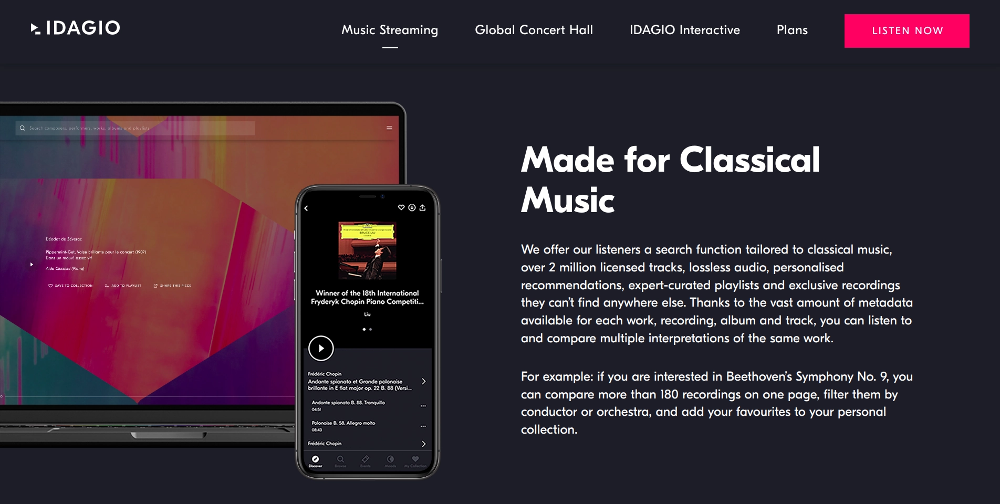
 

### Taking things forward

I've focused on western music here, but someone else could take this work forward by looking at the various music services and looking at how well they cover Indian music. The code's all there in the [Github repo](https://github.com/shijithpk/music-streaming-india), all you would need is a dataset of albums for each Indian language from the past and present that are critically acclaimed. 

The difficulty with doing something for Indian music is finding publications whose judgement you can trust. With the publications and websites I used here for my lists, there were multiple 'signals', including mentions in other publications, which made me confident about using them. The thing with Indian music is because there are multiple languages here, it's difficult for outsiders to get a sense of which publication or website is reliable without using Google Translate to an annoying extent.

I guess one way you could do it while still sticking to English-language websites is to collect info on the National Film awards or State Film Awards for the last N years, look at the movies/composers/singers that get nominated, and use the lists of nominees to compile a dataset. Unfortunately, this will exclude the independent music scene outside movies.

### Want to hire me?

I've been on a pandemic break, but with this project over, I'm ready to get back to full-time work. Have a look at the rest of [my website](https://shijith.com/). If you like what I've done and think I could be of value to your company, email me at [mail@shijith.com](mailto:mail@shijith.com) or message me on [LinkedIn](https://www.linkedin.com/in/shijith/).