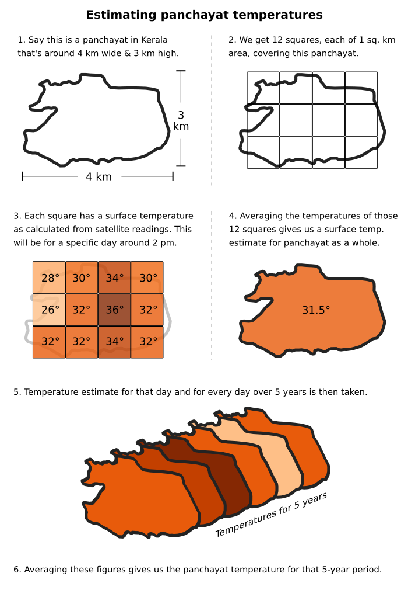
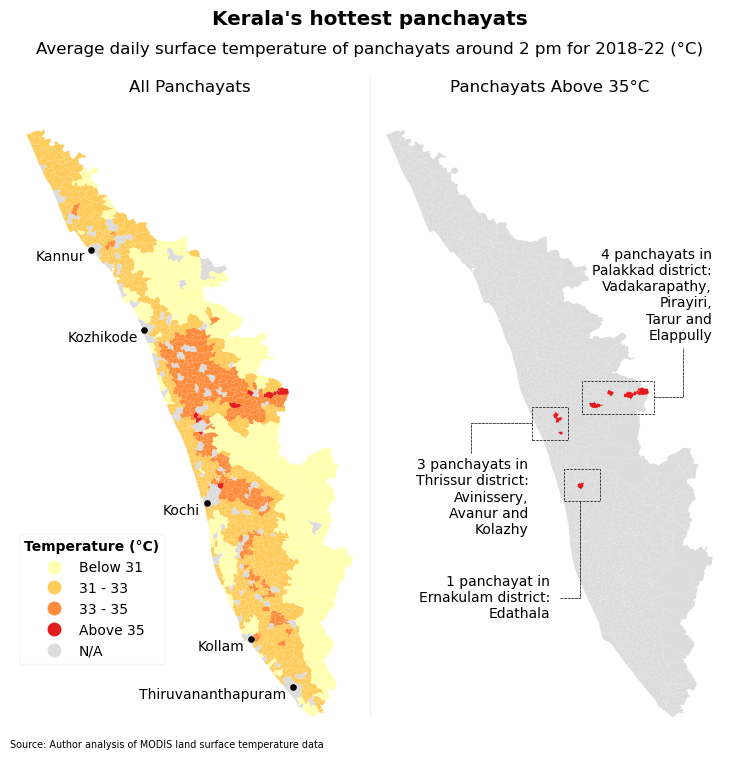
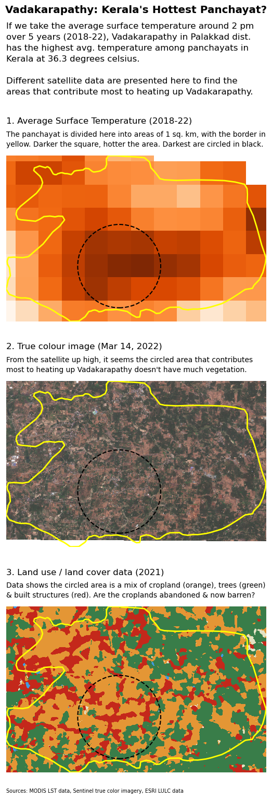
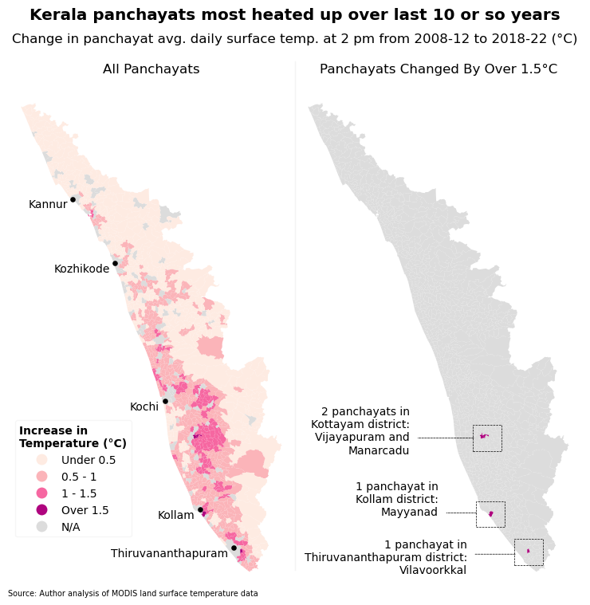
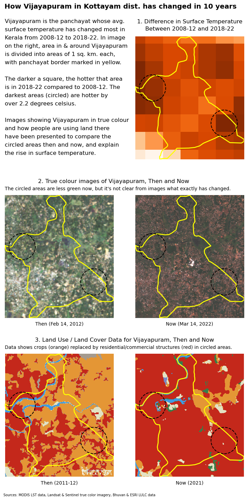
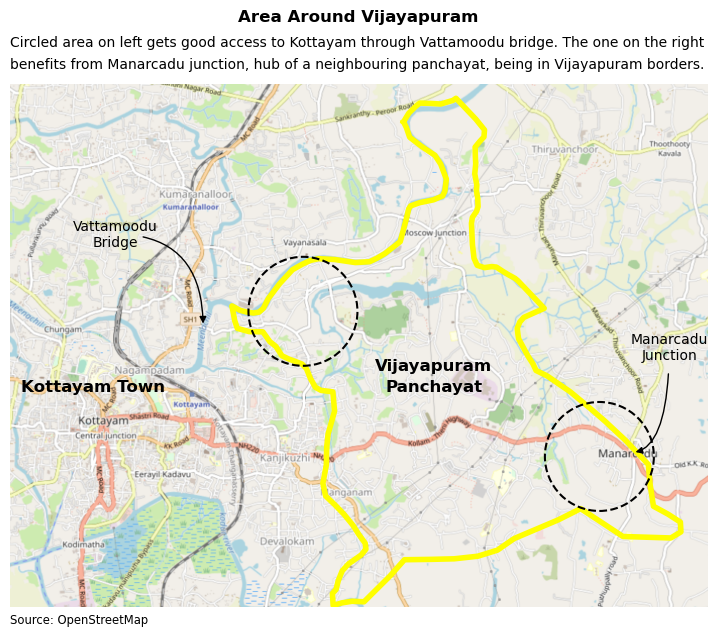
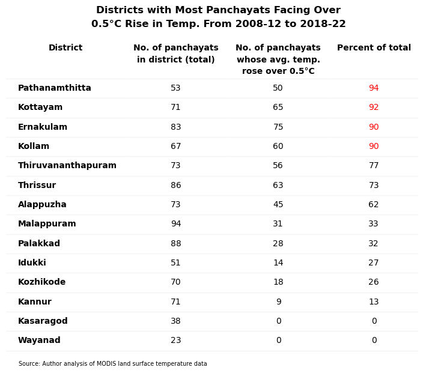
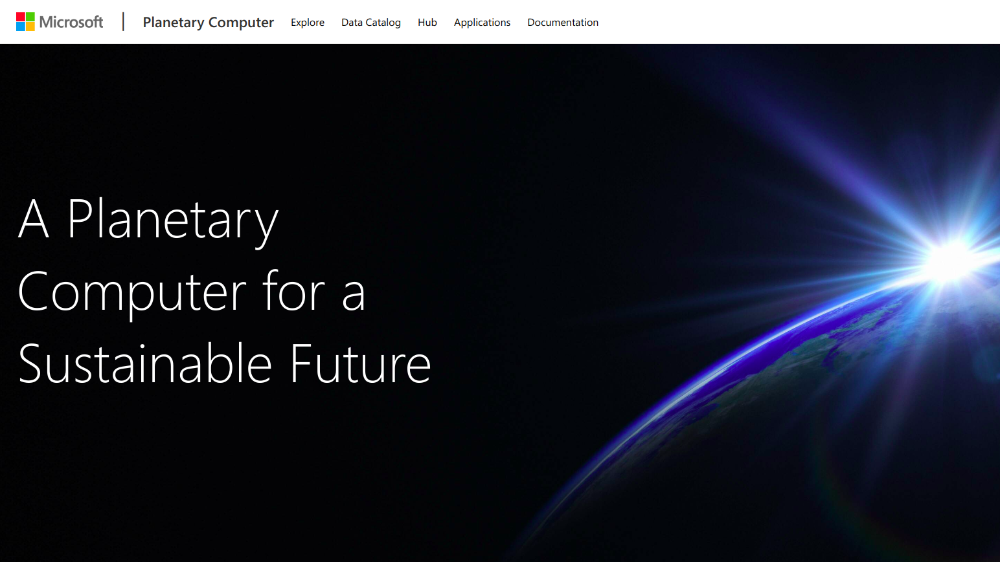

+++
title = "What are the hottest panchayats in Kerala?"
description = "A look at which panchayats in the southern state are hottest on average, and which ones have heated up most in the last 10 years"
[extra]
thumbnail = 'IMAGES/00_thumbnail.png'
+++

### TLDR

The story looks at rural Kerala and how it's heated up over the last 10 or so years.

Analysis of satellite data shows that in the afternoon, the hottest panchayats tend to be in central Kerala, namely the districts of Ernakulam, Thrissur and Palakkad. A panchayat named Vadakarapathy in Palakkad is the hottest on average.

And if we compare recent temperatures to 10-plus years ago, panchayats in southern Kerala, namely the districts of Kottayam, Kollam and Thiruvanthapuram have heated up the most. Vijayapuram in Kottayam district recorded the biggest rise in temperature.

Aggregating figures at a state level, 55% of Kerala's panchayats have grown hotter by over half a degree celsius in the last 10 years or so.

We also investigate Vadakarapathy and Vijayapuram using various kinds of satellite data to find out what's special about them. 

The sun looming over Chinese fishing nets in Kerala. Credit: [Tim Moffatt/Flickr](https://flic.kr/p/at87Ho)

### Why I'm doing this blogpost

Kerala is ridiculously hot, so hot that [some wags](https://www.reddit.com/r/Kerala/comments/zafi01/comment/iylmttd/?utm_source=reddit&utm_medium=web2x&context=3) say the state only has two seasons—'dry' summer and 'wet' summer. I can personally attest to how much warmer Kerala has gotten over the years, most likely an effect of urbanisation and development. 

Higher temperatures are a problem because of how it affects your quality of life. It makes it tougher for you to focus on your studies or work, and if you have air conditioners, you have to operate them at colder settings, running up your electricity bills.

This blogpost is an attempt to quantify how hot things are at present and get a rough idea of how much worse things have gotten over the years.

I focused on rural Kerala because I live in a village myself, and so does 52 percent of the state's population. City dwellers and their problems get enough attention as it is from governments, academia and the media, so I wanted to correct for that. 

I've chosen the panchayat as the unit of study, because it represents the lowest level of government, and hopefully the findings here will spur village authorities into action by taking steps to bring temperatures down and improve livability. 

### How we analysed the temperatures

The temperatures of panchayats here are determined from satellite data. Instruments named [MODIS](https://en.wikipedia.org/wiki/Moderate_Resolution_Imaging_Spectroradiometer) aboard two NASA satellites detect the radiation emitted by a surface, and from those readings surface temperatures are estimated for every square kilometre of earth.

These NASA satellites pass over Kerala 4 times daily—11:10 am, 2:10 pm, 11:10 pm and 2:10 am approximately. So we get 4 different surface temperature estimates in a day. We will just consider a single temperature, the one for 2:10 pm because that will be closest to the maximum for the day (which is when people feel the most discomfort). 

The temperature for every square km within the territory of the panchayat is taken and averaged to arrive at a figure for the panchayat itself. We calculate panchayat temperatures for every day over five years and then average them to get a representative temperature for that five-year period. We consider two five-year periods in our analysis: 2018-2022 and 2008-2012.

(Am averaging over five years instead of taking a single year just in case that year's figures are anomalous in any way. Taking the most recent five years gives us a more accurate idea of what a place's temperature profile is.)

<!-- METHODOLOGY GRAPHIC  -->

 		
### Hottest panchayats over recent years

We first look at the hottest panchayats over the past five years, 2018 to 2022. When we map things out, we see the hottest panchayats are around central Kerala (Ernakulam, Thrissur and Palakkad districts) and parts of northern Kerala. 

If we separate just the panchayats with average surface temperatures over 35°C, three of them are in Thrissur district, one in Ernakulam dist. and four in Palakkad, including the hottest, Vadakarapathy. It has the highest average daily temperature—36.3°C over the past five years. So what makes it the hottest?

### Why is Vadakarapathy the hottest panchayat?

To find out what makes it so hot, we divided it into areas of 1 sq. km each, to see which parts are to blame. In the graphic below, the hottest squares are circled in black.

If we look at those circled areas in true color, it's evident there isn't much vegetation there. And land use/land cover data for 2021 tells us it's a mix of cropland (orange in the graphic), trees (green) and built-up structures (red) on that piece of land.

From the news stories I've been reading, Palakkad [gets pretty hot](https://www.newindianexpress.com/states/kerala/2020/mar/20/sizzling-at-41&deg;c-palakkad-dist-reels-under-heatstroke-threat-2119044.html) usually. And on Vadakarapathy in particular, reports say the panchayat is [prone to drought](https://www.newindianexpress.com/states/kerala/2015/mar/22/Open-Ponds-Driving-Change-in-Water-Scene-in-Palakkad-731697.html), people get their water from tankers here, which is unusual for a Kerala village. And that because of the shortage of water, farmers have even [abandoned farming](https://www.newindianexpress.com/states/tamil-nadu/2015/apr/07/3-Palakkad-Panchayats-Await-Chandys-Nod-to-Extend-Canal-739157.html).

So even though land use/land cover data has categorised much of the land in the circled area as cropland, my suspicion is that there isn't much more farming taking place there. So the land use algorithms still identify the land as cropland because of the shape of the plots etc. but it is effectively barren. And barren land gets very hot and shows up darker in temperature grids.

This is just speculation though. If the story gets picked up by a media publication, I'll look into it further and ask some academic or expert to provide more insight.

### Panchayats that have heated up the most

To see which panchayat's temperatures have changed most from the past, we compared the average surface temperature over 2018-2022 to another five-year period in the past, 2008-2012.

The results show it's the panchayats in southern Kerala—namely Kottayam, Kollam and Thiruvanthapuram districts—whose temperature profile have changed the most. 

The panchayat that has heated up most is Vijayapuram in Kottayam, whose average daily temperature increased by 1.7°C (from 32.3°C in 2008-12 to 34°C in 2018-22). So what's led to this rise in surface temperature? 

### Why has Vijayapuram heated up most?

To find out what human interventions could've changed the character of Vijayapuram, we divided the panchayat into areas of 1 sq. km each to see which sections have heated up the most. 

Those sections have been circled in black in the graphic below.

In the graphic, comparing true color imagery from past and present doesn't really give us an insight into what's changed. The land use and land cover comparison gives us a better idea of what's happened with cropland in the circled areas being replaced by built-up structures (homes, complexes etc.)

Zooming out and situating Vijayapuram in its broader geographical context clears things up a little. We see that the circle on the left is just 5 km from Kottayam, an important urban centre in Kerala.

The opening of Vattamoodu bridge [in 2016](https://www.youtube.com/watch?v=iwuOX540mUQ) across the Meenachil river has made them even more connected and possibly led to increased urbanisation of the circled area on the left. 

Development in circled area on the right—and increased surface temperature—may be a response to the presence of Manarcadu junction, the hub of neighbouring panchayat Manarcadu, being inside Vijayapuram borders. In fact, Manarcadu's own gram panchayat office is at the junction too.

But Manarcadu junction would've been around earlier too, and if that's the case, it doesn't really explain what has changed and what has led to this increase in development—and surface temperature—from 2008-12 to 2018-22.

Again, I should stress this is all just speculation and I'll investigate more if a publication picks this up.

### How things look at the district level

One interesting exercise would be to see things in a bigger picture than individual panchayats, and check how Kerala's rural areas are heating up at a district level. 

We do this by looking at what percent of a district's panchayats have had their average daily temperature rise by more than 0.5 degrees celsius—0.5°C being the threshold of what could be considered a significant increase. 

The data shows that for the state as a whole, 55% of Kerala's panchayats have grown hotter by over half a degree celsius in the last 10 or so years.

In the southern Kerala districts of Pathanamthitta, Kottayam and Kollam, over 90 per cent of their panchayats have seen the average daily temperature rise by at least 0.5°C from 2008-12 to 2018-22. 

The temperature profile of southern Kerala changing like this most probably reflects larger shifts in the character of those places (less rural, more urban). 

## Side notes
Caveats, doubts and other random thoughts I couldn't fit into the copy above. (I'm done with my story, so you can stop reading here if you want, just doing some housekeeping from this point on.)

### Using satellite data instead of weather station readings

So why am I using satellite data for this project, figuring out temperatures of a place from hundreds of kilometres up in the sky, instead of using data from instruments closer to the ground? 

Well it partly has to do with the granularity I can get. With a satellite, I can get the surface temperature for an area as small as a square kilometre. Combine a few of them and you can get the temperature for a whole panchayat. 

But we can't do that with readings from weather stations, because of how few weather stations there are in Kerala compared to panchayats. There are 941 panchayats but only [around 100](http://aws.imd.gov.in:8091/state.php?id=KERALA) working weather stations in Kerala, so if you're looking to get panchayat-wise temperatures, you're out of luck. 

So it makes more sense to use an indicator like land surface temperature which we can calculate for every panchayat.

### Using surface temperatures instead of air temperatures

One issue with using land surface temperatures is that it doesn't sync with what people normally understand as temperature. 

What people think of as temperature is usually measured in the air 2 metres above the surface, while satellite data gives us the temperature of *the surface itself*. 

The lack of enough weather stations to construct panchayat-wise temperatures has already been mentioned.

An alternative is to use historical 2m air temperature data from the [ERA5-Land](https://cds.climate.copernicus.eu/cdsapp#!/dataset/reanalysis-era5-land?tab=overview) dataset. This is a reanalysis dataset that combines actual observations and estimates.

ERA5-Land being a reanalysis product would've still been acceptable for our purposes, but for the poor resolution of the dataset, around 9 km. So a single temperature from that dataset will be for a 9 x 9 or 81 sq km area. But 81 sq km could comprise multiple panchayats as a majority of Kerala's panchayats are less than 40 sq km in area, half that size. 

So chances are you'll have to use the same reading for multiple panchayats and you won't get any differentiation between them.

Since 2m air temperature tracks land surface temperatures and the two are [closely related](https://centaur.reading.ac.uk/71902/7/Good_et_al-2017-Journal_of_Geophysical_Research__Atmospheres.pdf), using surface temperature as a proxy indicator is acceptable, even if it isn't a perfect substitute. It will allow us to compare one panchayat to another, and give us a rough idea of how hot or not people feel at different times of the day.

### Not really a climate change story

So we're aren't talking about changes on a global scale or tracking the increase in temperatures from pre-industrial levels hundreds of years ago or some other period like 1951-1980.

Typical image that accompanies climate change stories. Credit: [NASA](https://data.giss.nasa.gov/gistemp/maps/index_v4.html)

This is more about increases in surface temperature that are a result of recent human interventions like building homes, shops, urbanisation in general.

(For sure, climate change would've contributed in some part to the rise in temperatures, but it would be difficult for me at my skill level to quantify the exact contribution.) 

So we won't pay attention to effects like rise in sea levels, coastal erosion or erraticness in rainfall patterns. This is more about the impact on plain day-to-day livability, how high temperatures affect the movement of people during the day, their studies, their work etc.

	
### There will be data missing

The thing with satellite data is that you only get observations when the sky is free of clouds. So because we're dealing with Kerala, a state that has monsoon weather from June to November, six months in a row, there's likely to be large gaps in the temperature data during that period. 

But I'm ok with that because I'm thinking the rainy weather will be affecting all areas equally. Maybe some areas more than others on particular days, but that over a long enough period like five years, it all averages out.

Plus the heating up of rural Kerala isn't that evident to people during the monsoon months. It's during the 'fair weather' months of December to May that these hellish temperatures come into play. So even if less data is available for more-cloudier months, that is fine as our look into the discomfort people feel isn't affected.

But in the interest of transparency, people should understand that the temperature estimates we've calculated here are not based on data for all days, but data for all days *it's available*.

### Not against development

Now a rise in land surface temperature is an outcome of urbanisation, an increase in man-made structures etc., which is considered development by many. So if this development leads to jobs, a rise in incomes or new homes, isn't that a good thing? 

So I don't have a problem with people trying to create a better situation for themselves and their families. I'm not against new construction, all I'm saying is that the heating up of rural Kerala is a result of everything that's going on. And that authorities need to do more to counter this rise in temperatures by promoting use of white cement on roofs, rooftop gardens etc.

### Points of interest for peers in Indian data journalism

I guess one thing that's kind of innovative with this story is the extensive use of Microsoft's [Planetary Computer](https://planetarycomputer.microsoft.com/). One of the problems with using geospatial data is how big the files are sometimes, so your computer's memory and processing limits can get in the way. 

Using services like Planetary Computer can help avoid that by offloading work to remote servers that are more powerful and have instant access to data. An alternative to Planetary Computer is Google Earth Engine, think I've seen Pulaha Roy from *Down to Earth* use it in his work.

Screenshot of Planetary Computer homepage

Another thing I've worked hard at doing is to make the results in this story completely reproducible. The code is all there in a [jupyter notebook](https://github.com/shijithpk/hottest-panchayats-kerala/blob/main/code_final.ipynb) on Github, and it can be run cell by cell to get the original results. Whenever I've worked with geospatial data in the past, it's usually been in graphical tools like QGIS, and it's hard for others to replicate its results. There are no such issues here with the workflow fully in code.

I've also tried to focus less on finding universal patterns or making generalisable claims. For example, when I looked at the hottest panchayats above or the ones that have heated up most, I didn't try to come up with factors common to these panchayats that would explain  their situation. 

For example, I didn't describe the rise in temperatures over southern Kerala as possibly an effect of their less urbanised starting point, because of which any growth leads to a marked rise in surface temperatures. I do make a point about the geographical location of these panchayats (ones in central Kerala hottest etc.) but that's about it. 

Instead I focused on individual panchayats (Vadakarapathy and Vijayapuram) and tried to see what data could tell us about them. A lot of journalism is actually just that, focusing on specific cases and I'd forgotten about this aspect of the profession.

But I was reminded of it by a [2022 story](https://peabee.substack.com/p/17-one-kitchen-hundreds-of-internet) from techie Prashant Baid that hyper-focused on one Bangalore cloud kitchen and exposed its shady practices with the help of data. I'm going to make a conscious effort to do similar investigative work that isn't about making grand claims.

## Suggestions, feedback

All code for my story is available in the [github repo](https://github.com/shijithpk/hottest-panchayats-kerala).

If there are things here I should be doing differently, do let me know! Contact me at mail@shijith.com or at this Twitter handle [@shijith](https://twitter.com/shijith).